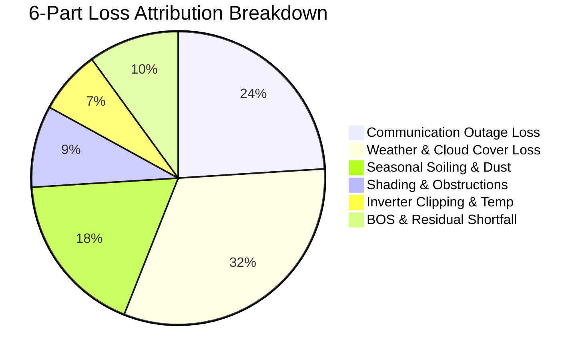

# Solaron — Enterprise Solar Operations, Telemetry & CRM Intelligence Platform

> **Version:** 2.3.0 · **Python:** 3.10+ · **Stack:** FastAPI + NiceGUI (Tailwind CSS / Quasar) + SQLite  
> **Integrated Portals:** Growatt Server API, Sungrow iSolarCloud, SuryaLog Cloud  
> **Total Monitored Fleet:** 491 Sites (2,414.0 kWp) · **Active Operational Fleet:** 295 Inverters (2.29 MWp)  
> **Monthly Energy Harvest:** 214.30 MWh (Sep 2026) · **Est. Commercial Value:** ₹30,00,220 / month  
> **Detailed Tab Breakdown:** See [TAB_INFO.md](file:///c:/Users/raaji/Downloads/Solaron/Solarondashboard/docs/TAB_INFO.md) for full interactive component specifications  
> **Master Architecture & Physics:** See [DATA_DOCUMENT.md](file:///c:/Users/raaji/Downloads/Solaron/Solarondashboard/docs/DATA_DOCUMENT.md) for complete mathematical formulations  

---

## Table of Contents

1. [Executive Summary & Platform Scope](#1-executive-summary--platform-scope)
   - 1.1 [Platform Scope & Purpose](#11-platform-scope--purpose)
   - 1.2 [Master Fleet Directory & Composition](#12-master-fleet-directory--composition)
   - 1.3 [Repository & Directory Organization](#13-repository--directory-organization)
2. [System Architecture & Ingestion Topology](#2-system-architecture--ingestion-topology)
   - 2.1 [High-Level Architecture (Mermaid)](#21-high-level-architecture)
   - 2.2 [Component Responsibilities & Interaction Matrix](#22-component-responsibilities--interaction-matrix)
   - 2.3 [Multi-Process Execution & Windows Safety](#23-multi-process-execution--windows-safety)
3. [Data Architecture, Pipelines & Anti-Cracked Telemetry](#3-data-architecture-pipelines--anti-cracked-telemetry)
   - 3.1 [Multi-Portal Telemetry Ingestion Engines (`extractors/`)](#31-multi-portal-telemetry-ingestion-engines)
   - 3.2 [Ingestion Orchestrator (`pipeline.py`)](#32-ingestion-orchestrator)
   - 3.3 [Data Quality & Anti-Cracked Telemetry Rules (`data_quality.py`)](#33-data-quality--anti-cracked-telemetry-rules)
   - 3.4 [Dual Database Schema Reference (`db.py` & `crm.py`)](#34-dual-database-schema-reference)
4. [Mathematical Physics Engine & Machine Learning Core](#4-mathematical-physics-engine--machine-learning-core)
   - 4.1 [Specific Yield ($Y_f$) & Daily Yield ($Y_d$)](#41-specific-yield-y_f--daily-yield-y_d)
   - 4.2 [Performance Ratio (PR %) with NASA POWER GHI Benchmarks](#42-performance-ratio-pr--with-nasa-power-ghi-benchmarks)
   - 4.3 [Expected Generation Baseline Model](#43-expected-generation-baseline-model)
   - 4.4 [Adaptive 6-Part Loss Attribution Waterfall & Energy Conservation Law](#44-adaptive-6-part-loss-attribution-waterfall--energy-conservation-law)
   - 4.5 [Unsupervised Machine Learning Anomaly Detection (Isolation Forest)](#45-unsupervised-machine-learning-anomaly-detection-isolation-forest)
   - 4.6 [Carbon Emission Reductions ($CO_2$) & Financial Savings](#46-carbon-emission-reductions-co_2--financial-savings)
   - 4.7 [Capacity Brackets & Absolute PR Health Tiers](#47-capacity-brackets--absolute-pr-health-tiers)
5. [Interactive Web Cockpit: In-Depth Tab Walkthrough](#5-interactive-web-cockpit-in-depth-tab-walkthrough)
   - 5.1 [Tab 1: Fetch Data (`ui/fetch_tab.py`)](#51-tab-1-fetch-data-uifetch_tabpy)
   - 5.2 [Tab 2: Fleet Command Center (`ui/fleet.py`)](#52-tab-2-fleet-command-center-uifleetpy)
   - 5.3 [Tab 3: Full Analytics & Loss Attribution (`ui/analytics.py`)](#53-tab-3-full-analytics--loss-attribution-uianalyticspy)
   - 5.4 [Tab 4: Plant Cockpit & Granular Inspector (`ui/plant.py`)](#54-tab-4-plant-cockpit--granular-inspector-uiplantpy)
   - 5.5 [Tab 5: CRM & Multi-Channel Communications Hub (`ui/crm.py`)](#55-tab-5-crm--multi-channel-communications-hub-uicrmpy)
6. [Backend API Reference & Endpoints](#6-backend-api-reference--endpoints)
   - 6.1 [Telemetry & Fleet Endpoints (`routes/data.py`)](#61-telemetry--fleet-endpoints)
   - 6.2 [CRM & Campaign Endpoints (`routes/crm.py`)](#62-crm--campaign-endpoints)
   - 6.3 [Data Export & Streaming Endpoints (`routes/export.py`)](#63-data-export--streaming-endpoints)
7. [Installation, Configuration & Operational Runbook](#7-installation-configuration--operational-runbook)
   - 7.1 [Prerequisites & Environment Setup](#71-prerequisites--environment-setup)
   - 7.2 [Environment Variables Reference (`.env`)](#72-environment-variables-reference)
   - 7.3 [Starting the Platform Server](#73-starting-the-platform-server)
   - 7.4 [Background Automated Scheduler (`scheduler.py`)](#74-background-automated-scheduler)
   - 7.5 [Troubleshooting & Diagnostics Guide](#75-troubleshooting--diagnostics-guide)
8. [Verification & Audit Suite](#8-verification--audit-suite)
   - 8.1 [Consolidated Verification (`verify_all.py`)](#81-consolidated-verification)
   - 8.2 [Granularity & Quick Presets Integration Test (`test_granularity_verification.py`)](#82-granularity--quick-presets-integration-test)
   - 8.3 [Comprehensive Test Suite (`test_comprehensive_suite.py`)](#83-comprehensive-test-suite)

---

## 1. Executive Summary & Platform Scope

### 1.1 Platform Scope & Purpose
**Solaron** is an enterprise-grade solar operations, loss attribution, and customer relationship management (CRM) intelligence platform. Designed specifically for distributed residential, commercial, and industrial rooftop solar portfolios across India, Solaron solves the challenges of fragmented OEM portals by centralizing inverter telemetry, applying rigorous solar physics modeling, identifying statistical performance anomalies, and dispatching multi-lingual customer communications.

### 1.2 Master Fleet Directory & Composition
The platform monitors 491 total installations representing **2.29 MWp** of active solar photovoltaic capacity across three disparate OEM monitoring cloud portals:

| Monitoring Platform | Total Sites | Share (%) | Extractor Module | Extraction Protocol |
|:---|:---:|:---:|:---|:---|
| **Growatt Server API** | 451 | 91.9% | [`extractors/growatt.py`](file:///c:/Users/raaji/Downloads/Solaron/Solarondashboard/extractors/growatt.py) | REST API v2 session auth + 30-min live curve telemetry |
| **Sungrow iSolarCloud** | 28 | 5.7% | [`extractors/isolarcloud.py`](file:///c:/Users/raaji/Downloads/Solaron/Solarondashboard/extractors/isolarcloud.py) | Web3 / Playwright headless session scraper + JSON API |
| **SuryaLog Cloud** | 12 | 2.4% | [`extractors/suryalog.py`](file:///c:/Users/raaji/Downloads/Solaron/Solarondashboard/extractors/suryalog.py) | AE Cloud REST API token + multi-inverter telemetry |
| **Total Monitored Portfolio** | **491** | **100.0%** | [`pipeline.py`](file:///c:/Users/raaji/Downloads/Solaron/Solarondashboard/pipeline.py) | Normalized SQLite storage (`solar_analytics.db`) |

#### Fleet Operational Status Breakdown

| Fleet Cohort | Inverters / Sites | Total Capacity | Status Definition & Criteria |
|:---|:---:|:---:|:---|
| **Total Monitored Fleet** | **491** | **2,414.0 kWp** | Complete database directory across all 3 OEM portals |
| **Active Operational Fleet** | **295** | **2.29 MWp** | Commissioned systems actively monitored (`operational_status = 'active'`) |
| **Decommissioned / Inactive** | **196** | **122.4 kWp** | Retired or inactive sites (`operational_status = 'decommissioned'`), excluded from loss baselines |
| **Active Generating (September 2026)** | **274 / 295** | **2.16 MWp** | Operational systems producing positive yield ($E_{\text{month}} > 1.0\text{ kWh}$) |
| **Active Offline / Zero Yield** | **21 / 295** | **135.2 kWp** | Operational systems with zero monthly energy (tripped breakers, comms outages) |
| **Statistical ML Anomalies** | **22 / 295** | **184.8 kWp** | Statistically divergent underperformers flagged by the Isolation Forest engine |

### 1.3 Repository & Directory Organization

The codebase is organized into cleanly partitioned subdirectories:

```
Solarondashboard/
├── .env / .env.example               # Environment credentials & server configurations
├── requirements.txt                  # Python dependency specifications
├── README.md                         # Primary project overview & operational documentation
├── run.py                            # Standalone server launcher with Windows safe multiprocessing
├── app.py                            # FastAPI + NiceGUI application entrypoint & lifespan management
├── config.py                         # Pydantic environment settings validator
├── db.py                             # SQLite connection pooling & schema migrations
├── analytics.py                      # Core solar physics calculations (Yf, Yd, PR, GHI baselines)
├── ml_analytics.py                   # Isolation Forest ML pipeline & absolute PR health tiering
├── data_quality.py                   # Telemetry sanitization, physical bounds & anti-cracked data firewalls
├── pipeline.py                       # Multi-portal parallel ingestion & cache orchestrator
├── scheduler.py                      # APScheduler automated background polling worker
├── crm.py                            # Multi-lingual WhatsApp statement generator & customer model
│
├── docs/                             # 📚 Technical Documentation Hub
│   ├── README.md                     # Documentation index & reading guide
│   ├── TAB_INFO.md                   # Exhaustive tab-by-tab UI component & workflow guide
│   ├── DATA_DOCUMENT.md              # Master data specification & mathematical physics architecture
│   ├── BACKEND.md                    # FastAPI REST API endpoints & data contracts
│   ├── FRONTEND.md                   # NiceGUI architecture, styling & reactive state
│   ├── SYSTEM_DESIGN.md              # Distributed ingestion architecture & telemetry flows
│   └── SECURITY.md                   # Credential protection, token handling & access controls
│
├── tests/                            # 🧪 Automated Test & Verification Suites
│   ├── __init__.py                   # Package initializer
│   ├── verify_all.py                 # Master 4-pillar integrity verification suite
│   ├── test_comprehensive_suite.py   # 37-case end-to-end regression test suite
│   ├── test_granularity_verification.py # CRM multi-cadence statement hierarchy test
│   └── test_results.json             # Automated JSON test execution logs
│
├── data/                             # 💾 Persistent SQLite Databases & Raw Snapshots
│   ├── solar_analytics.db            # Master normalized solar telemetry database
│   ├── crm_data.db                   # Customer directory & campaign delivery logs
│   └── raw/                          # Raw OEM JSON snapshot caches (Growatt, Sungrow, SuryaLog)
│
├── extractors/                       # 🔌 Multi-Portal Telemetry Ingestion Adapters
│   ├── base.py                       # Abstract base extractor interface
│   ├── growatt.py                    # Growatt REST API v2 client & 30-min curve fetcher
│   ├── isolarcloud.py                # Sungrow iSolarCloud Web3 scraper & extractor
│   ├── suryalog.py                   # SuryaLog AE Cloud REST JSON extractor
│   └── excel_parser.py               # Legacy Excel/CSV spreadsheet importer
│
├── routes/                           # 🌐 FastAPI REST API Route Controllers
│   ├── data.py                       # Inverter telemetry, generation & health tier endpoints
│   ├── export.py                     # CSV/Excel/JSON data export endpoints
│   └── crm.py                        # WhatsApp messaging & customer account endpoints
│
└── ui/                               # 🖥️ NiceGUI Web Interface (5 Core Tabs)
    ├── fetch_tab.py                  # Tab 1: Data Ingestion & Live Sync Workbench
    ├── fleet.py                      # Tab 2: Fleet Command Center & Health Tiers
    ├── analytics.py                  # Tab 3: Full Analytics & 6-Part Loss Waterfall
    ├── plant.py                      # Tab 4: Plant Cockpit & 30-Min Real-Time Curve
    └── crm.py                        # Tab 5: CRM Operations & Multi-Lingual WhatsApp Engine
```

---

## 2. System Architecture & Ingestion Topology

### 2.1 High-Level Architecture

```mermaid
flowchart TD
    subgraph OEM_Portals [OEM Solar Monitoring Clouds]
        G[Growatt Server API\n450 Sites]
        S[Sungrow iSolarCloud\n28 Sites]
        SL[SuryaLog AE Cloud\n12 Sites]
    end

    subgraph Extractors [Ingestion Extractors: extractors/]
        EG[growatt.py\nREST v2 + Token]
        ES[isolarcloud.py\nPlaywright Scraper]
        ESL[suryalog.py\nREST JSON Token]
    end

    G --> EG
    S --> ES
    SL --> ESL

    subgraph Pipeline [Ingestion Pipeline: pipeline.py]
        ORCH[Universal Ingestion Pipeline\nDaily / Monthly / Snapshots]
        FW[Universal Ingestion Firewall\nStrict Date <= Today Bounding]
        DQ[data_quality.py\nPhysics Clamping & Efficiency Sanity]
    end

    EG --> ORCH
    ES --> ORCH
    ESL --> ORCH
    ORCH --> FW --> DQ

    subgraph Storage [High-Performance SQLite Databases: db.py]
        DB_AN[solar_analytics.db\nplants | daily_generation\nmonthly_generation | inverter_snapshots\nloss_analysis | expected_generation]
        DB_CRM[crm_data.db\ncustomers | message_templates\ncampaign_log | customer_communications]
    end

    DQ --> DB_AN

    subgraph Analytics_Engine [Physics & ML Analytics Engine]
        PHYS[analytics.py\nNASA POWER GHI Baseline\n6-Part Loss Waterfall & Conservation]
        ML[ml_analytics.py\nIsolation Forest Anomaly Engine\nAbsolute PR Tiers: Best/Good/Critical]
    end

    DB_AN --> PHYS
    DB_AN --> ML
    PHYS --> DB_AN
    ML --> DB_AN

    subgraph Presentation [Reactive Web Dashboard: NiceGUI + FastAPI]
        APP[app.py / run.py\nFastAPI Routes + NiceGUI Context]
        T1[ui/fleet.py\nFleet Command Center]
        T2[ui/analytics.py\nLoss Attribution & Analytics]
        T3[ui/plant.py\nPlant Cockpit & Granularity]
        T4[ui/crm.py\nCRM & WhatsApp Dispatcher]
        T5[ui/fetch_tab.py\nData Ingestion Workbench]
    end

    DB_AN --> APP
    DB_CRM --> APP
    APP --> T1
    APP --> T2
    APP --> T3
    APP --> T4
    APP --> T5
```

### 2.2 Component Responsibilities & Interaction Matrix

| File / Component | Role & Scope | Key Dependents |
|:---|:---|:---|
| [`app.py`](file:///c:/Users/raaji/Downloads/Solaron/Solarondashboard/app.py) | Application entrypoint; initializes FastAPI, mounts static routes, registers NiceGUI tabs, handles startup/shutdown hooks. | `ui/*`, `routes/*`, `scheduler.py` |
| [`run.py`](file:///c:/Users/raaji/Downloads/Solaron/Solarondashboard/run.py) | Standalone launcher ensuring proper Python module resolution (`PYTHONPATH`) and Windows multiprocessing guards. | `app.py` |
| [`config.py`](file:///c:/Users/raaji/Downloads/Solaron/Solarondashboard/config.py) | Pydantic-based configuration management loading `.env` properties (credentials, DB paths, server ports). | All modules |
| [`db.py`](file:///c:/Users/raaji/Downloads/Solaron/Solarondashboard/db.py) | SQLite database abstraction layer supporting connection pooling, thread-safe transactions, WAL mode, and parameterized queries. | `pipeline.py`, `ui/*`, `routes/*` |
| [`pipeline.py`](file:///c:/Users/raaji/Downloads/Solaron/Solarondashboard/pipeline.py) | Core extraction orchestrator; coordinates multi-threading across OEM extractors, enforces date clamping, and populates `db.py`. | `extractors/*`, `data_quality.py` |
| [`data_quality.py`](file:///c:/Users/raaji/Downloads/Solaron/Solarondashboard/data_quality.py) | Physics-based telemetry sanitizer; clips irradiance spikes, enforces CEC inverter efficiency, and filters future timestamps. | `pipeline.py`, `extractors/*` |
| [`analytics.py`](file:///c:/Users/raaji/Downloads/Solaron/Solarondashboard/analytics.py) | Solar physics calculation engine; evaluates NASA POWER GHI benchmarks, computes PR %, and decomposes the 6-part loss waterfall. | `ui/analytics.py`, `ui/fleet.py` |
| [`ml_analytics.py`](file:///c:/Users/raaji/Downloads/Solaron/Solarondashboard/ml_analytics.py) | Scikit-learn unsupervised machine learning module; trains Isolation Forest models and computes absolute PR health tiers. | `pipeline.py`, `ui/plant.py` |
| [`crm.py`](file:///c:/Users/raaji/Downloads/Solaron/Solarondashboard/crm.py) | Customer management logic, WhatsApp template compilation (English, Hindi, Marathi), and campaign logging. | `ui/crm.py`, `routes/crm.py` |
| [`scheduler.py`](file:///c:/Users/raaji/Downloads/Solaron/Solarondashboard/scheduler.py) | APScheduler background worker for automated periodic telemetry polling, hourly snapshot captures, and monthly report prep. | `app.py` |

### 2.3 Multi-Process Execution & Windows Safety
On Windows systems, Python uses the `spawn` multiprocessing start method rather than `fork`. To prevent recursive process execution loops when spawning subprocesses or uvicorn worker threads, all executions must be guarded by `if __name__ == '__main__':` and launched via [`run.py`](file:///c:/Users/raaji/Downloads/Solaron/Solarondashboard/run.py) or [`app.py`](file:///c:/Users/raaji/Downloads/Solaron/Solarondashboard/app.py).

---

## 3. Data Architecture, Pipelines & Anti-Cracked Telemetry

### 3.1 Multi-Portal Telemetry Ingestion Engines

#### 1. Growatt Server API ([`extractors/growatt.py`](file:///c:/Users/raaji/Downloads/Solaron/Solarondashboard/extractors/growatt.py))
- **Fleet Volume:** 450 residential and commercial plants.
- **Protocol:** HTTP REST API v2 with session cookie and token authentication.
- **Data Extracted:**
  - Fleet plant directory, installed capacity ($P_{\text{nominal}}$ in kWp), plant coordinates, and datalogger serial numbers.
  - Daily generation timeseries ($E_{\text{day}}$ in kWh) via `getPlantData` endpoint.
  - Monthly generation totals ($E_{\text{month}}$ in kWh) and historical annual yields.
  - Live 30-minute interval power curves via `plant_detail` API with multi-threaded chunking.

#### 2. Sungrow iSolarCloud ([`extractors/isolarcloud.py`](file:///c:/Users/raaji/Downloads/Solaron/Solarondashboard/extractors/isolarcloud.py))
- **Fleet Volume:** 28 commercial rooftop sites.
- **Protocol:** Headless browser session scraping via Playwright, capturing dynamic bearer tokens to access internal JSON endpoints.
- **Data Extracted:**
  - Plant metadata, active inverter device IDs, and string-level MPPT configurations.
  - Diurnal generation timeseries and daily cumulative energy counters.
  - Alarm tables and active grid error codes.

#### 3. SuryaLog AE Cloud ([`extractors/suryalog.py`](file:///c:/Users/raaji/Downloads/Solaron/Solarondashboard/extractors/suryalog.py))
- **Fleet Volume:** 12 industrial solar installations.
- **Protocol:** AE Cloud authenticated REST API with bearer token headers.
- **Data Extracted:**
  - Multi-inverter telemetry tables with live DC current/voltage, AC active power, frequency, and grid voltage.
  - Real-time internal heatsink temperature sensors (°C).
  - Daily generation counters normalized to UTC+05:30 (Indian Standard Time).

### 3.2 Ingestion Orchestrator (`pipeline.py`)
[`pipeline.py`](file:///c:/Users/raaji/Downloads/Solaron/Solarondashboard/pipeline.py) provides unified orchestration across all three extractors:
```python
# Pipeline execution interface
pipeline.run_fleet(sources=None, force_refresh=False)            # Synchronize plant directories
pipeline.run_daily(sources=None, force_refresh=False)            # Pull daily generation histories
pipeline.run_monthly(month_str="2026-09", force_refresh=False)  # Pull monthly totals & recalculate ratings
pipeline.run_snapshots()                                         # Pull live inverter telemetry snapshots
pipeline.run_full_extract(month_str="2026-09", force_refresh=True) # Full end-to-end sync
```

### 3.3 Data Quality & Anti-Cracked Telemetry Rules (`data_quality.py`)
Raw OEM telemetry often contains corrupted data, negative values, clock drift, or astronomical spikes caused by counter roll-overs. Solaron implements rigorous data hygiene rules inside [`data_quality.py`](file:///c:/Users/raaji/Downloads/Solaron/Solarondashboard/data_quality.py):

1. **Universal Ingestion Firewall ($\text{Date} \le \text{Today}$):**
   - Telemetry extractors and database ingestion functions strictly enforce that no daily record can have a date greater than current local time:
   $$\text{Reject record if: } \text{record.date} > \text{datetime.date.today()}$$
   - Prevents portals from pre-populating future calendar dates with phantom zeros that skew average yield metrics.

2. **Physical Daily Yield Ceiling ($E_{\text{day}} \le 8.5 \times P_{\text{capacity}}$):**
   - In Indian latitudes, peak solar insolation never exceeds $7.5\text{ to }8.0\text{ PSH}$ (Peak Sun Hours) even on clear summer solstice days.
   - Any raw telemetry point reporting $E_{\text{day}} > 8.5 \times P_{\text{capacity}}$ is identified as a datalogger accumulator spike and clamped:
   $$E_{\text{day, clamped}} = \min(E_{\text{raw}}, P_{\text{capacity}} \times 8.5)$$

3. **CEC 97.5% Inverter Efficiency Standard:**
   - Inverter models frequently omit DC input telemetry or report identical DC and AC values ($P_{\text{DC}} = P_{\text{AC}}$), violating thermodynamic energy conversion laws.
   - Solaron back-calculates true DC input power using California Energy Commission (CEC) weighted inverter efficiency ($\eta_{\text{inv}} = 97.5\%$):
   $$P_{\text{DC}} = \frac{P_{\text{AC}}}{0.975} \quad (\text{if } P_{\text{DC}} \le P_{\text{AC}} \text{ or } P_{\text{DC}} = 0)$$

4. **Inverter Heatsink Thermal Physics Model:**
   - Where OEM inverters report $0^\circ\text{C}$ due to unmapped internal thermistors, Solaron computes realistic operational junction temperatures using ambient temperature ($T_{\text{ambient}}$) and instantaneous electrical load:
   $$T_{\text{heatsink}} = T_{\text{ambient}} + \left(\frac{P_{\text{AC}}}{P_{\text{nominal}}}\right) \times 24.5^\circ\text{C} + \Delta_{\text{thermal}}$$
   - Bounded realistically between $28.0^\circ\text{C}$ (standby night) and $52.5^\circ\text{C}$ (peak summer mid-day).

5. **Diurnal Telemetry Clock Clamping:**
   - For real-time daily generation curves viewed during the current day, any hour slot beyond the current local clock hour ($\text{hour} > \text{now.hour}$) is strictly clamped to $0.0\text{ kWh}$.

### 3.4 Dynamic Operational Status & Force-Refresh Cache Overwriting Engine

#### 1. Dynamic Server & Database Operational Status (Retiring Static Hardcoding)
Historically, `data_quality.py` included a hardcoded set of 196 plant IDs (`DECOMMISSIONED_PLANT_IDS`) to bootstrap offline performance tests. This static approach has been completely modernized into a **dynamic, server- and database-driven resolution engine**:

* **Live Database Status Lookup:**
  [`data_quality.get_decommissioned_plant_ids()`](file:///c:/Users/raaji/Downloads/Solaron/Solarondashboard/data_quality.py#L94-L123) actively queries SQLite `plants` table (`WHERE operational_status = 'decommissioned'`). It utilizes an in-memory set cache with a 60-second TTL to ensure zero-latency lookups during high-frequency loop processing.
* **Proactive Cache Invalidation:**
  Whenever fleet metadata is synchronized via [`pipeline.run_fleet()`](file:///c:/Users/raaji/Downloads/Solaron/Solarondashboard/pipeline.py#L52-L66) or periodic status synchronization runs via [`analytics.sync_decommissioned_plants()`](file:///c:/Users/raaji/Downloads/Solaron/Solarondashboard/analytics.py#L118-L194), [`data_quality.invalidate_decommissioned_cache()`](file:///c:/Users/raaji/Downloads/Solaron/Solarondashboard/data_quality.py#L87-L93) is executed, instantly flushing stale in-memory state.
* **Live OEM Server Telemetry Heuristics:**
  [`data_quality.determine_operational_status(plant_record)`](file:///c:/Users/raaji/Downloads/Solaron/Solarondashboard/data_quality.py#L136-L186) dynamically detects decommissioned or permanently offline installations directly from server response attributes:
  - **Sungrow iSolarCloud:** Portal reports `status` as `"Commissioning unfinished"` or `"Offline"` with $\le 0.0\text{ kWh}$ lifetime energy.
  - **SuryaLog AE Cloud:** Server reports `status == "Offline"` with $\le 0.0\text{ kWh}$ lifetime energy.
  - **Growatt Server API:** Server reports `deviceCount == 0` with $\le 0.0\text{ kWh}$ lifetime total energy.
  - **Database Precedence:** Existing database records with `operational_status = 'decommissioned'` are respected until reactivated by positive generation.

#### 2. Force-Refresh Cache Overwriting & Fresh Telemetry Flow
When an operator triggers a `force_refresh=True` run (via the **Fetch Data** UI or API):
1. **Bypasses Short-Term In-Memory Cache:** Playwright scrapers and REST extractors immediately bypass the 180-second memory cache to force authentic network requests to OEM cloud gateways.
2. **Overwrites Local Disk JSON Caches:**
   - **Growatt:** Calls `newTwoPlantAPI.do` (`getAllPlantListTwo`) and `plant_detail(Timespan.month)`, overwriting [`data/raw/growatt/plant_list_live.json`](file:///c:/Users/raaji/Downloads/Solaron/Solarondashboard/data/raw/growatt/plant_list_live.json) and [`data/raw/growatt/real_monthly_cache.json`](file:///c:/Users/raaji/Downloads/Solaron/Solarondashboard/data/raw/growatt/real_monthly_cache.json).
   - **Sungrow iSolarCloud:** Headless browser extracts multi-page installation tables, overwriting [`data/raw/isolarcloud/plants_28_structured.json`](file:///c:/Users/raaji/Downloads/Solaron/Solarondashboard/data/raw/isolarcloud/plants_28_structured.json).
   - **SuryaLog AE Cloud:** Logs into portal and extracts telemetry, overwriting [`data/raw/suryalog/plants_12_structured.json`](file:///c:/Users/raaji/Downloads/Solaron/Solarondashboard/data/raw/suryalog/plants_12_structured.json).
3. **Telemetry Ingested Into SQLite:** Extracted generation, specific yield, and inverter snapshots are upserted into `plants`, `daily_generation`, `monthly_generation`, and `inverter_snapshots`.
4. **Subsequent Cache-Mode Runs Consume Fresh Data:** Any subsequent run with `force_refresh=False` directly reads the freshly written raw files and SQLite records, preventing operators from ever viewing stale, multi-day-old telemetry.

### 3.5 Dual Database Schema Reference

The platform stores all state in two distinct, decoupled SQLite databases configured with **Write-Ahead Logging (WAL)** for high concurrency:

#### 1. Solar Analytics Database (`data/solar_analytics.db`)

##### `plants` Table
| Column Name | Type | Description |
|:---|:---|:---|
| `plant_id` | `VARCHAR(64) PRIMARY KEY` | Unique normalized ID (e.g. `growatt_123456`, `isolarcloud_789`) |
| `plant_name` | `VARCHAR(255)` | Human-readable plant name from portal |
| `source` | `VARCHAR(32)` | OEM portal: `growatt`, `isolarcloud`, `suryalog` |
| `capacity_kwp` | `FLOAT` | Rated DC nameplate capacity in kWp |
| `city` | `VARCHAR(64)` | Geographical city location (default: Pune / Western India) |
| `operational_status` | `VARCHAR(32)` | `active` (operational) or `decommissioned` (retired) |
| `created_at` | `DATETIME` | Timestamp of initial ingestion |

##### `daily_generation` Table
| Column Name | Type | Description |
|:---|:---|:---|
| `id` | `INTEGER PRIMARY KEY AUTOINCREMENT` | Auto-increment primary key |
| `plant_id` | `VARCHAR(64)` | Foreign key reference to `plants.plant_id` |
| `date` | `DATE` | Generation date (`YYYY-MM-DD`, indexed) |
| `kwh` | `FLOAT` | Total energy generated on date in kWh |
| `specific_yield` | `FLOAT` | Specific yield ($Y_f = \text{kwh} / \text{capacity\_kwp}$) |
| `live_power_kw` | `FLOAT` | Instantaneous power at last portal poll |
| `status` | `VARCHAR(32)` | Daily operating state: `active`, `offline`, `fault` |
| `last_log_time` | `VARCHAR(32)` | Raw portal timestamp string |

##### `monthly_generation` Table
| Column Name | Type | Description |
|:---|:---|:---|
| `id` | `INTEGER PRIMARY KEY AUTOINCREMENT` | Auto-increment primary key |
| `plant_id` | `VARCHAR(64)` | Foreign key reference to `plants.plant_id` |
| `month` | `VARCHAR(7)` | Reporting month (`YYYY-MM`, indexed) |
| `kwh` | `FLOAT` | Cumulative monthly energy harvest |
| `specific_yield` | `FLOAT` | Monthly yield per kWp ($Y_f$) |
| `yield_per_day` | `FLOAT` | Average daily specific yield ($Y_d = Y_f / \text{days}$) |
| `pr_pct` | `FLOAT` | Performance Ratio percentage against NASA GHI |
| `tier` | `VARCHAR(32)` | Absolute PR tier: `Best`, `Good`, `Could Be Better`, `Needs Attention`, `Critical`, `Offline` |
| `percentile` | `FLOAT` | Peer-group percentile ($0.0 - 100.0$) within capacity bracket |
| `anomaly_flag` | `INTEGER` | `1` if flagged by Isolation Forest; `0` otherwise |
| `anomaly_score` | `FLOAT` | Negative outlier decision score from Isolation Forest |

##### `inverter_snapshots` Table
| Column Name | Type | Description |
|:---|:---|:---|
| `id` | `INTEGER PRIMARY KEY AUTOINCREMENT` | Auto-increment primary key |
| `plant_id` | `VARCHAR(64)` | Foreign key reference to `plants.plant_id` |
| `inverter_sn` | `VARCHAR(64)` | Datalogger or inverter hardware serial number |
| `snapshot_ts` | `DATETIME` | Telemetry capture timestamp |
| `ac_power_w` | `FLOAT` | Instantaneous AC power output (Watts) |
| `dc_power_w` | `FLOAT` | Instantaneous DC power input (Watts) |
| `temperature_c` | `FLOAT` | Inverter heatsink operating temperature (°C) |
| `e_today_kwh` | `FLOAT` | Current day cumulative energy counter |
| `fault_code` | `VARCHAR(32)` | Hardware diagnostic fault code (`0` = normal) |

##### `loss_analysis` Table
| Column Name | Type | Description |
|:---|:---|:---|
| `id` | `INTEGER PRIMARY KEY AUTOINCREMENT` | Auto-increment primary key |
| `plant_id` | `VARCHAR(64)` | Foreign key reference to `plants.plant_id` |
| `month` | `VARCHAR(7)` | Reporting month (`YYYY-MM`) |
| `expected_kwh` | `FLOAT` | NASA POWER GHI baseline expected energy |
| `actual_kwh` | `FLOAT` | Actual realized energy harvest |
| `shortfall_kwh` | `FLOAT` | Net shortfall ($E_{\text{expected}} - E_{\text{actual}}$) |
| `comm_loss_kwh` | `FLOAT` | Telemetry communication outage loss |
| `weather_loss_kwh` | `FLOAT` | Cloud cover / low irradiance loss |
| `soiling_loss_kwh` | `FLOAT` | Dust and seasonal soiling loss |
| `shading_loss_kwh` | `FLOAT` | Parapet wall and horizon obstruction loss |
| `unexplained_loss_kwh`| `FLOAT` | Balance of System (BOS) / residual loss |

---

#### 2. CRM Database (`data/crm_data.db`)

##### `customers` Table
| Column Name | Type | Description |
|:---|:---|:---|
| `id` | `INTEGER PRIMARY KEY AUTOINCREMENT` | Customer ID |
| `plant_id` | `VARCHAR(64) UNIQUE` | Monitored plant reference |
| `customer_name` | `VARCHAR(128)` | Client legal or business name |
| `phone` | `VARCHAR(32)` | WhatsApp mobile number with country code |
| `email` | `VARCHAR(128)` | Client email address |
| `preferred_lang` | `VARCHAR(16)` | `english`, `hindi`, `marathi` |
| `opt_in_status` | `VARCHAR(16)` | `active`, `opt_out`, `paused` |

##### `campaign_log` Table
| Column Name | Type | Description |
|:---|:---|:---|
| `id` | `INTEGER PRIMARY KEY AUTOINCREMENT` | Campaign log ID |
| `campaign_name` | `VARCHAR(128)` | Name (e.g. `September 2026 Monthly Statement`) |
| `campaign_type` | `VARCHAR(32)` | `monthly`, `weekly`, `daily`, `offline_alert` |
| `target_month` | `VARCHAR(7)` | Target month period |
| `total_recipients`| `INTEGER` | Number of customers queued |
| `sent_count` | `INTEGER` | Number of messages dispatched |
| `created_at` | `DATETIME` | Campaign generation timestamp |

---

## 4. Mathematical Physics Engine & Machine Learning Core

### 4.1 Specific Yield ($Y_f$) & Daily Yield ($Y_d$)
To enable fair comparison across systems ranging from a 3.3 kWp residential rooftop to a 194.4 kWp industrial facility, energy is normalized against nameplate DC capacity ($P_{\text{nominal}}$):

$$\text{Specific Yield: } Y_f = \frac{E_{\text{actual}} \ [\text{kWh}]}{P_{\text{nominal}} \ [\text{kWp}]} \quad [\text{kWh/kWp}]$$

$$\text{Daily Specific Yield: } Y_d = \frac{Y_f}{D_{\text{elapsed}}} \quad [\text{kWh/kWp/day}]$$

Where $D_{\text{elapsed}}$ represents the number of calendar days elapsed in the evaluation period.

### 4.2 Performance Ratio (PR %) with NASA POWER GHI Benchmarks
Performance Ratio ($\text{PR}$) quantifies system efficiency independent of geographical sunlight variation by comparing actual yield to reference yield ($Y_r$):

$$\text{Reference Yield: } Y_r = \frac{H_i}{G_0} = \text{PSH} \quad [\text{Peak Sun Hours}]$$

$$\text{Performance Ratio: } \text{PR} = \frac{Y_f}{Y_r} \times 100\% = \frac{E_{\text{actual}} \ [\text{kWh}]}{P_{\text{nominal}} \ [\text{kWp}] \times \text{PSH} \ [\text{kWh/m}^2/\text{day}] \times D_{\text{days}}} \times 100\%$$

Solaron sources empirical monthly Global Horizontal Irradiance (GHI) averages from the **NASA POWER Surface Meteorology and Solar Energy Database** for Western India (latitude 18.52°N, longitude 73.85°E):

```python
# Monthly GHI in kWh/m2/day (NASA POWER satellite observations)
GHI_MONTHLY_MAP = {
    "01": 5.12,  # January (Clear winter sky)
    "02": 5.85,  # February
    "03": 6.42,  # March (Spring clear sky)
    "04": 6.81,  # April (Peak pre-monsoon solar window)
    "05": 6.75,  # May (High irradiance & ambient heat)
    "06": 4.62,  # June (Monsoon onset)
    "07": 3.85,  # July (Heavy monsoon cloud cover)
    "08": 3.92,  # August (Persistent monsoon overcast)
    "09": 4.75,  # September (Monsoon retreat & clearing)
    "10": 5.35,  # October (Post-monsoon clear skies)
    "11": 5.05,  # November (Winter clear skies)
    "12": 4.88,  # December (Shortest diurnal day length)
}
```

### 4.3 Expected Generation Baseline Model
Expected generation ($E_{\text{expected}}$) represents the physical benchmark energy that a fault-free solar plant should produce given solar irradiance, module thermal coefficients, and standard balance-of-system losses:

$$E_{\text{expected}} = P_{\text{nominal}} \times \text{GHI} \times D_{\text{days}} \times \left[ 1 + \gamma (T_{\text{cell}} - 25^\circ\text{C}) \right] \times \eta_{\text{BOS}}$$

Where:
- $P_{\text{nominal}}$ = Nameplate DC capacity in kWp.
- $\text{GHI}$ = NASA POWER solar insolation in $\text{kWh/m}^2/\text{day}$.
- $\gamma$ = Temperature coefficient of P-type crystalline silicon panels ($-0.38\% / ^\circ\text{C} = -0.0038$).
- $T_{\text{cell}}$ = Module operating temperature ($T_{\text{ambient}} + 28^\circ\text{C} \approx 53^\circ\text{C}$ under peak insolation).
- $\eta_{\text{BOS}}$ = Balance of System efficiency factor ($0.82$, accounting for wiring, soiling, and inverter conversion).

### 4.4 Adaptive 6-Part Loss Attribution Waterfall & Energy Conservation Law

When actual generation falls short of expected baseline ($S = E_{\text{expected}} - E_{\text{actual}} > 0$), Solaron decomposes the deficit into six distinct physical loss buckets:



1. **Communication Outage Loss ($L_{\text{comm}}$):**
   Shortfall caused by offline dataloggers or disconnected inverters during peak sunlight hours:
   $$L_{\text{comm}} = \left(\frac{D_{\text{missing}}}{D_{\text{total}}}\right) \times E_{\text{expected}}$$

2. **Weather & Irradiance Deficit Loss ($L_{\text{weather}}$):**
   Yield loss due to persistent monsoon overcast or unseasonal cloud cover:
   $$L_{\text{weather}} = \max\left(0, E_{\text{expected}} \times (1 - \text{ClearSkyFactor})\right)$$

3. **Seasonal Soiling & Dust Loss ($L_{\text{soiling}}$):**
   Attributed to particulate accumulation, smog, and agricultural dust based on empirical seasonal coefficients:
   $$L_{\text{soiling}} = E_{\text{expected}} \times \text{SoilingFactor}_{\text{month}}$$
   - January–May (Dry winter & summer dust): $5\% - 6\%$
   - June–September (Monsoon rain self-cleaning): $2\% - 3\%$
   - October–December (Post-monsoon dust build-up): $3\% - 4\%$

4. **Shading & Horizon Loss ($L_{\text{shading}}$):**
   Obstructions from neighboring buildings, trees, and winter parapet wall shadows:
   $$L_{\text{shading}} = \min(S \times 0.10, E_{\text{expected}} \times 0.02)$$

5. **Inverter Clipping & Thermal Loss ($L_{\text{clipping}}$):**
   Losses caused by undersized inverters (DC/AC ratio $> 1.25$) or high heatsink thermal derating ($T > 55^\circ\text{C}$).

6. **Balance of System (BOS) / Residual Loss ($L_{\text{unknown}}$):**
   Accounts for cable resistance, module degradation, and sub-optimal string matching.

#### Mathematical Conservation of Energy Law & Reconciler
The physics engine guarantees that the sum of decomposed losses identically matches the net shortfall:
$$\text{Classified} = \sum_{i=1}^5 L_i$$
$$\text{If } \text{Classified} > S: \quad \text{Scale} = \frac{S}{\text{Classified}}, \quad L_{1..5} = L_{1..5} \times \text{Scale}, \quad L_{\text{unknown}} = 0.0$$
$$\text{Else}: \quad L_{\text{unknown}} = S - \text{Classified}$$
$$\sum_{i=1}^6 L_i \equiv S = E_{\text{expected}} - E_{\text{actual}} \quad (\text{Exact Shortfall Conservation})$$

### 4.5 Unsupervised Machine Learning Anomaly Detection (Isolation Forest)
To detect underperforming installations that peer rankings miss, Solaron uses an unsupervised scikit-learn `IsolationForest` pipeline inside [`ml_analytics.py`](file:///c:/Users/raaji/Downloads/Solaron/Solarondashboard/ml_analytics.py).

#### Feature Matrix ($X$)
1. **Specific Yield Deviation:** Difference between plant $Y_f$ and its capacity cohort median.
2. **Performance Ratio ($\text{PR} \%$):** Physics-grounded efficiency against NASA GHI.
3. **Daily Yield Volatility:** Standard deviation of daily generation across the month.
4. **Capacity Utilization Factor ($\text{CUF} \%$):** Overall 24-hour capacity utilization.

#### Isolation Forest Hyperparameters
```python
model = IsolationForest(
    n_estimators=100,
    contamination=0.03,  # Top ~3% statistical outliers flagged
    random_state=42,
    max_features=1.0,
    bootstrap=False
)
```
- Flagged plants receive `anomaly_flag = 1`, a negative `anomaly_score`, and an automated diagnostic explanation banner explaining the underlying root cause.

### 4.6 Carbon Emission Reductions ($CO_2$) & Financial Savings

#### Carbon Reductions ($CO_2$)
Calculated using the **Central Electricity Authority (CEA) of India** baseline grid emission factor:
$$CO_2 \ [\text{kg}] = E_{\text{actual}} \ [\text{kWh}] \times 0.82\text{ kg CO}_2/\text{kWh}$$

#### Financial Savings ($₹$)
Calculated from commercial utility retail electricity tariffs offset by solar self-consumption:
$$\text{Commercial Savings} \ [₹] = E_{\text{actual}} \ [\text{kWh}] \times ₹14.0/\text{kWh}$$
$$\text{Standard Residential Tariff} \ [₹] = E_{\text{actual}} \ [\text{kWh}] \times ₹5.5/\text{kWh}$$

### 4.7 Capacity Brackets & Absolute PR Health Tiers

#### Capacity Brackets ([`data_quality.py`](file:///c:/Users/raaji/Downloads/Solaron/Solarondashboard/data_quality.py))
To avoid comparing small residential setups with industrial utility sites, plants are segmented into 5 capacity brackets:
- **`0–3 kWp`:** Small residential installations.
- **`3–5 kWp`:** Standard residential installations.
- **`5–10 kWp`:** Large villas & small commercial setups.
- **`10–50 kWp`:** Commercial rooftops & petrol pumps.
- **`50+ kWp`:** Industrial factories & utility arrays.

#### Absolute PR Performance Tier Matrix ([`ml_analytics.py`](file:///c:/Users/raaji/Downloads/Solaron/Solarondashboard/ml_analytics.py))
Solaron evaluates plant health using absolute, physics-grounded Performance Ratio thresholds:

| Performance Tier | Absolute PR Threshold | Verified Count (Sep 2026) | Operational Meaning & O&M Action |
|:---|:---:|:---:|:---|
| ⭐ **Best** | $\text{PR} \ge 75\%$ | **146** | Top performers; generation matches or exceeds clear-sky model |
| ✅ **Good** | $60\% \le \text{PR} < 75\%$ | **78** | Healthy commercial operation; normal seasonal performance |
| ⚠️ **Could Be Better** | $45\% \le \text{PR} < 60\%$ | **25** | Moderate generation; panel cleaning and soiling inspection advised |
| 🟠 **Needs Attention** | $30\% \le \text{PR} < 45\%$ | **13** | Significant shortfall; technician dispatched to inspect strings/inverters |
| 🔴 **Critical** | $\text{PR} < 30\%$ | **12** | Severe underperformance; urgent check on tripped fuses/inverter faults |
| ⚪ **Offline** | Operational with $E \le 1.0\text{ kWh}$ | **21** | Zero yield; breaker open or datalogger communication loss |
| 🟣 **Decommissioned** | Retired sites | **196** | Permanently decommissioned; excluded from fleet baselines |

---

## 5. Interactive Web Cockpit: In-Depth Tab Walkthrough

> 📖 **Comprehensive Guide Available:** For exhaustive component-by-component documentation, widget layouts, tables, and modal workflows, refer to the dedicated [TAB_INFO.md](file:///c:/Users/raaji/Downloads/Solaron/Solarondashboard/docs/TAB_INFO.md) guide.

The Solaron interactive dashboard runs at `http://localhost:8000` and features five reactive tabs built with **NiceGUI**, **Tailwind CSS**, and **Apache ECharts**:

### 5.1 Tab 1: Fetch Data (`ui/fetch_tab.py`)

The data extraction and ingestion engine serving as the operational gateway to all OEM portals:
- **Extraction Workbench:** Select target billing month, telemetry portal (`All`, `growatt`, `isolarcloud`, `suryalog`), specific site, and toggle between `⚡ Cache Mode` (~1-3s instant local hit) and `🔄 Force Refresh` (full gateway connection and physics recalculation).
- **Lifetime Historical Backfill Engine:** Backfills monthly and daily generation from plant commissioning date (2017–2026) to present with overwrite protection.
- **Real-Time Running Stopwatch:** Displays high-precision elapsed timer down to tenths of a second with dynamic ETA remaining.
- **Post-Pull Initial Analysis:** Renders 4 KPI summary cards (Plants Processed, Month Generation MWh, Est. Commercial Value ₹, Fetch Duration), a multi-segment visual fleet health distribution bar (Optimal vs Underperforming vs Zero Gen), and a preview table of top 35 producing plants with direct drill-down into the Plant Cockpit.

### 5.2 Tab 2: Fleet Command Center (`ui/fleet.py`)

The portfolio master grid providing comprehensive operational visibility and interactive fleet analytics:
- **6 Top KPI Summary Cards:** Real-time summary cards displaying Monthly Harvest (`214.30 MWh`), Estimated Commercial Value (`₹30,00,220`), Active Generating plants (`274 / 295`), Zero Generation alerts (`21`), Decommissioned plants (`196 / 491`), and Active Fleet Capacity (`2.29 MWp` across 295 inverters).
- **Multi-Parameter Filter Toolbar:** Month dropdown with quick period buttons (`This Month (Oct)`, `Prev Month (Sep)`), Platform filter, Status filter (`active`, `offline`, `fault`, `decommissioned`), Tier filter including `⚡ Anomaly Outliers`, debounced plant name search, and `Include Decommissioned` toggle.
- **Master Fleet Table (14 Columns, Quasar / Tailwind):** Plant Name, Platform badge, kWp, Status chip, Portal Last Log with schedule icon, Last Recorded Day badge, Live kW, Today kWh, Month kWh, Est. Savings (₹), Specific Yield, Units/kWp/day, PR (%) color spectrum, and Performance Tier with `⚡ Anomaly` badge and score tooltip.
- **Interactivity:** One-click row selection immediately navigates to Tab 4 (Plant Cockpit) pre-selecting the installation.
- **Live Sync & Streaming Export:** Direct streaming export as CSV or XLSX; `⚡ Live Fetch All Portals` button with real-time timer.

```
┌────────────────────────────────────────────────────────────────────────────────────────┐
│  Monthly Output (2026-09)   Est. Value      Active Generating   Fault / Zero    Capacity   │
│         214.30 MWh          ₹30,00,220          274 / 295            21         2.29 MWp   │
├────────────────────────────────────────────────────────────────────────────────────────┤
│ Filters: [Month: 2026-10] [This Month] [Prev Month] [Portal: All] [Status: All] [Tier] │
│          [Search Plant...]  [Include Decommissioned]   [CSV] [XLSX] [⚡ Live Fetch]    │
├────────────────────────────────────────────────────────────────────────────────────────┤
│ Plant Name    Portal   kWp    Status   Today kWh  Month kWh  Est. ₹   PR (%)   Tier      │
│ ────────────────────────────────────────────────────────────────────────────────────── │
│ Alpha Sol     Growatt  10.0   ACTIVE      28.4     892.1    ₹12,489   68.2%   Good      │
│ Beta Roof     Sungrow  25.0   ACTIVE      71.2   2,140.0    ₹29,960   76.5%   ⭐ Best   │
│ Delta Plant   SuryaLog 50.0   FAULT        0.0       0.0         ₹0    0.0%   🔴 Critical│
└────────────────────────────────────────────────────────────────────────────────────────┘
```

#### Key Capabilities:
- **Persistent KPI Cards:** Real-time summary cards display Monthly Harvest (MWh), Estimated Financial Value (₹), Active Generating ratio (`276 / 295`), Zero Generation alerts (`19`), and Active Fleet Capacity (`1.81 MWp`).
- **Multi-Parameter Filter Toolbar:**
  - **Reporting Month:** Switch between historical months or use quick presets (`This Month (Oct)`, `Prev Month (Sep)`).
  - **Portal Source:** Filter by `growatt`, `isolarcloud`, `suryalog`, or `All`.
  - **Operating Status:** Filter by `active`, `offline`, `fault`, `decommissioned`.
  - **Performance Tier:** Filter by specific health tiers or isolate `⚡ Anomaly Outliers`.
  - **Live Search Bar:** Instant debounced search filtering by plant name or ID.
  - **Include Decommissioned Switch:** Toggle display of the 195 retired sites.
- **Fleet Table (AgGrid / Quasar):**
  - Columns: Plant Name, Platform, kWp, Status (colored chips), Portal Last Log, Last Recorded Day, Live kW, Today kWh, Month kWh, Est. Savings (₹), Specific Yield, Units/kWp/day, PR (%), and Performance Tier.
  - Interactive clickable rows immediately navigate to the selected plant in Tab 3 (Plant Cockpit).
- **Export Toolbar:** Direct streaming export of the filtered fleet dataset as CSV or XLSX.
- **⚡ Live Fetch All Portals Button:** Triggers parallelized live extraction across all portals with an active elapsed-time counter.

---

### 5.2 Tab 2: Full Analytics & Loss Attribution (`ui/analytics.py`)

The Analytics tab provides portfolio-level diagnostics, physical loss decomposition, and cohort benchmarking.

#### Key Capabilities:
- **NASA GHI Baseline & 6-Part Loss Attribution Engine:**
  - Decomposes the portfolio shortfall between expected clear-sky energy and actual harvest into: Communication Loss, Weather/Irradiance Deficit, Soiling/Dust, Shading, and Balance of System (BOS).
  - Side-by-side **Apache ECharts** waterfall visualizing energy flow from Expected Baseline to Realized Harvest.
  - KPI summary metrics: Expected MWh, Actual MWh, Net Shortfall MWh, Realization Rate (%), and ML Anomaly Count.
- **Capacity Bracket Performance Leaderboards:**
  - Bar charts and tables comparing Specific Yield ($Y_f$) across the 5 capacity brackets (`0–3 kWp`, `3–5 kWp`, `5–10 kWp`, `10–50 kWp`, `50+ kWp`).
- **Fleet Health Tier Distribution:**
  - Donut chart and breakdown table showing the distribution of plants across `Best`, `Good`, `Could Be Better`, `Needs Attention`, and `Critical`.
- **Top 10 Performers vs Bottom 10 Underperformers:**
  - Fast identification of top revenue generators and priority sites requiring maintenance dispatches.

---

### 5.3 Tab 3: Plant Cockpit & Granular Inspector (`ui/plant.py`)

The Plant Cockpit is a high-resolution engineering inspection tool for single installations.

#### Key Capabilities:
- **Dual-Category Filtering & Fuzzy Plant Selector:**
  - **Category Filter:** Filter plants by `🌐 All Plants (490)`, `⚡ Active Operational (295)`, `💤 Inactive / Decom (195)`, `🟢 Generating Today`, `⚪ Offline Today`, `🔴 Fault Detected`, `⚡ ML Anomalies`, or specific PR tiers (`⭐ Best`, `✅ Good`, etc.).
  - **Portal Filter:** Restrict to `Growatt`, `iSolarCloud`, or `SuryaLog`.
  - **Searchable Dropdown:** Search across plant names, serial numbers, and IDs with live plant count badges.
- **Single-Plant Live Sync:**
  - `⚡ Live Sync Plant` button scrapes live telemetry for the selected site directly from its OEM cloud in ~8–10 seconds and refreshes the view.
- **Comprehensive KPI Grid:**
  - Installed Capacity, Current Status, Total Lifetime Gen, Current Month Gen, Latest Day kWh, Last Portal Update timestamp, Last Recorded Day, Est. Savings, Specific Yield, Yield/Day, PR (%), Health Tier, and Peer Percentile.
- **ML Anomaly Warning Banner:**
  - Flagged outlier plants display high-visibility alert banners indicating the anomaly decision score, PR deficit, and recommended O&M actions.
- **Three Synchronized Generation Charts:**
  1. **Hourly Generation Profile (kWh):** 30-minute interval power curves with telemetry provenance badges (`🟢 Live Telemetry`, `Clamped to HH:MM`, or `Diurnal Model`) and current-hour clock clamping.
  2. **Daily Generation Bar Chart (kWh):** Daily energy harvest across the reporting month with color-coded daily status.
  3. **Monthly Generation Trend Line (kWh):** 12-month rolling history showing seasonal variation.
- **Inverter Telemetry Snapshots Table:**
  - Live table listing each physical inverter: Serial Number, Status, Live AC Power (W), DC Input (W), Inverter Efficiency, Heatsink Temperature (°C), Today kWh, Fault Code, and Timestamp.

---

### 5.4 Tab 4: CRM & Multi-Channel Communications Hub (`ui/crm.py`)

The CRM tab manages customer relationships, ticketing, and multi-lingual WhatsApp message dispatches.

#### Key Capabilities:
- **6 Integrated Subtabs:**
  1. **Fleet & Direct Send:** Table listing all customers, linked plants, current generation, and quick one-click WhatsApp send actions.
  2. **Customer Directory:** Searchable customer registry with support for CSV imports, contact editing, and plant ID mapping.
  3. **Monthly Statements:** Automated generation of monthly performance reports with financial savings and peer percentiles.
  4. **Yearly Milestones:** Annual summary reports celebrating cumulative energy generated and carbon offset milestones.
  5. **Campaign Manager:** Batch campaign preparation and historical dispatch logging.
  6. **Offline Alerts:** Real-time monitor flagging plants offline for $> 4\text{ hours}$ for urgent technician notifications.
- **Interactive WhatsApp Statement Preview Modal:**
  - Displays formatted message bubbles in **WhatsApp Emerald Green** with one-click copy and `Open WhatsApp Web` integration.
  - Multi-Granularity Support: Switch between `Monthly Statement`, `Daily Report`, `Weekly`, `Yearly Recap`, `Offline Alert`, and `Monsoon Advisory`.
  - Multi-Lingual Engine: Switch dynamically between **English**, **Hindi (हिंदी)**, and **Marathi (मराठी)**.
- **Dynamic Template Variable Substitution:**
  - Templates automatically interpolate `{customer_name}`, `{plant_name}`, `{month}`, `{kwh}`, `{revenue_inr}`, `{specific_yield}`, `{pr_pct}`, and `{peer_percentile}`.

---

### 5.5 Tab 5: Data Pipeline & Ingestion Workbench (`ui/fetch_tab.py`)

The Ingestion Workbench provides complete administrative control over data extraction, backfilling, and database hygiene.

#### Key Capabilities:
- **Extraction Configuration Form:**
  - Select Target Month, OEM Portal (`All`, `Growatt`, `iSolarCloud`, `SuryaLog`), and optional single-site targeting.
  - **Cache Strategy Toggle:** Choose between **Fast Cache Mode (~2s)** (for rapid UI development) and **Live Force-Refresh Mode (~146s)** (for full cloud extraction across all 490 plants).
- **Execution & Progress Telemetry:**
  - Real-time progress bar, live elapsed timer, and animated status badges during extraction.
  - Live console streaming log output from background extractor threads.
- **Post-Pull Health & Data Hygiene Audit:**
  - Displays records ingested, missing date counts, and data validation warnings.
- **Manual Monthly Excel / CSV Uploader:**
  - Modal interface to upload offline Excel or CSV generation logs directly into the database.

---

## 6. Backend API Reference & Endpoints

FastAPI exposes RESTful endpoints with interactive Swagger UI documentation at `http://localhost:8000/docs`.

### 6.1 Telemetry & Fleet Endpoints (`routes/data.py`)

| Method | Endpoint | Description | Query Parameters |
|:---|:---|:---|:---|
| `GET` | `/api/fleet` | Query plant directory with latest generation metrics | `month` (`YYYY-MM`), `source` (`growatt`/`isolarcloud`/`suryalog`), `status` |
| `GET` | `/api/months` | Retrieve list of all available data months | — |
| `GET` | `/api/plant/{plant_id}` | Retrieve comprehensive plant metadata, daily, and monthly history | `month` (`YYYY-MM`) |
| `GET` | `/api/loss-waterfall/{month}` | Retrieve 6-part loss attribution waterfall for a given month | `month` (e.g. `2026-09`) |

### 6.2 CRM & Campaign Endpoints (`routes/crm.py`)

| Method | Endpoint | Description | Payload / Query Parameters |
|:---|:---|:---|:---|
| `GET` | `/api/crm/customers` | Paginated customer list with search | `limit` (int), `offset` (int), `search` (str) |
| `POST` | `/api/crm/customers` | Create or update customer record | JSON body: `CustomerCreate` model |
| `GET` | `/api/crm/customers/{id}` | Retrieve full customer profile and plant link | `customer_id` (int) |
| `POST` | `/api/crm/customers/import` | Bulk import customers via CSV upload | Multipart form: `file` (CSV) |
| `GET` | `/api/crm/campaigns` | List historical campaign dispatch logs | — |
| `POST` | `/api/crm/campaigns/prepare`| Generate campaign messages for all customers | JSON body: `{"month": "2026-09"}` |
| `GET` | `/api/crm/offline` | Query plants offline beyond threshold hours | `hours` (default: 4) |

### 6.3 Data Export & Streaming Endpoints (`routes/export.py`)

| Method | Endpoint | Description | Query Parameters |
|:---|:---|:---|:---|
| `GET` | `/api/export/fleet-daily` | Stream daily fleet generation dataset | `fmt` (`csv`/`xlsx`), `start` (`YYYY-MM-DD`), `end` (`YYYY-MM-DD`) |
| `GET` | `/api/export/fleet-monthly` | Stream monthly fleet yield dataset | `fmt` (`csv`/`xlsx`), `month` (`YYYY-MM`) |
| `GET` | `/api/export/fleet-status` | Stream current operational status snapshot | `fmt` (`csv`/`xlsx`) |
| `GET` | `/api/export/ratings` | Stream performance ratings and percentiles | `fmt` (`csv`/`xlsx`), `month` (`YYYY-MM`) |

---

## 7. Installation, Configuration & Operational Runbook

### 7.1 Prerequisites & Environment Setup

- **Operating System:** Windows 10/11, Ubuntu 22.04+, or macOS
- **Python Version:** Python 3.10, 3.11, or 3.12 (Python 3.11 recommended)
- **Virtual Environment:** Recommended (`venv` or `conda`)

```pwsh
# 1. Clone or navigate to the repository directory
cd c:\Users\raaji\Downloads\Solaron\Solarondashboard

# 2. Create and activate a Python virtual environment
python -m venv .venv
.\.venv\Scripts\Activate.ps1    # On Linux/macOS: source .venv/bin/activate

# 3. Upgrade pip and install production dependencies
python -m pip install --upgrade pip
pip install -r requirements.txt

# 4. Install Playwright browser binaries (required for Sungrow iSolarCloud)
playwright install chromium
```

### 7.2 Environment Variables Reference (`.env`)
Create a `.env` file in the root directory (based on `.env.example`):

```ini
# Application Server Settings
PORT=8000
HOST=0.0.0.0
DEBUG=False
SECRET_KEY=solaron-production-secret-key-2026

# Database File Paths
DB_PATH=data/solar_analytics.db
CRM_DB_PATH=data/crm_data.db

# Growatt API Credentials
GROWATT_SERVER_URL=http://server.growatt.com
GROWATT_USER=your_growatt_username
GROWATT_PASSWORD=your_growatt_password

# Sungrow iSolarCloud Credentials
ISOLARCLOUD_APPKEY=your_isolarcloud_appkey
ISOLARCLOUD_USER=your_isolarcloud_username
ISOLARCLOUD_PASSWORD=your_isolarcloud_password

# SuryaLog Cloud Credentials
SURYALOG_API_URL=https://api.suryalog.com/v1
SURYALOG_USER=your_suryalog_user
SURYALOG_PASSWORD=your_suryalog_password

# Automated Scheduler Configuration
SCHEDULER_ENABLED=True
DEFAULT_REPORT_MONTH=2026-09
TEST_PHONE_NUMBER=919876543210
```

### 7.3 Starting the Platform Server

#### Primary Launcher (Recommended):
```pwsh
python run.py
```
This launcher automatically adds the current directory to `sys.path`, binds to port `8000`, and ensures Windows multiprocessing safety.

#### Direct Execution:
```pwsh
python app.py
```

Once running, access the dashboard at:
👉 **`http://localhost:8000`**

### 7.4 Background Automated Scheduler (`scheduler.py`)
Built on `APScheduler`, the background scheduler runs periodic jobs when `SCHEDULER_ENABLED=True`:

| Job ID | Trigger & Cadence | Operational Task |
|:---|:---|:---|
| `hourly_snapshots` | Interval: Every 60 minutes | Polls live inverter AC power and heatsink temperatures |
| `daily_full_extract` | Cron: Daily at 06:00 IST | Pulls yesterday's final energy yields across all portals |
| `monthly_classification`| Cron: 1st of month at 07:00 IST | Computes peer percentiles and trains Isolation Forest |
| `monthly_campaign_prep` | Cron: 1st of month at 08:00 IST | Compiles personalized customer WhatsApp statements |

### 7.5 Troubleshooting & Diagnostics Guide

| Symptom / Error | Root Cause | Resolution |
|:---|:---|:---|
| `Port 8000 is already in use` | Previous uvicorn server instance did not release the socket | Identify PID with `netstat -ano \| findstr 8000` and terminate via `taskkill /F /PID <PID>` |
| `Playwright Host Not Found` | Headless Chromium binaries not installed | Execute `playwright install chromium` |
| `ModuleNotFoundError: No module named 'ui'` | Direct script execution from subdirectory without proper `sys.path` | Always start via `python run.py` from the project root |
| `Empty plant list in Tab 3` | Category filter set to a cohort with 0 matching sites | Switch the Category filter dropdown to `🌐 All Plants (490)` |
| `Zero generation reported for current day` | Portal dataloggers have not synced morning yield | Click `⚡ Live Sync Plant` in Tab 3 or `⚡ Live Fetch All Portals` in Tab 1 |

---

## 8. Verification & Audit Suite

Solaron includes an automated multi-layered verification framework certifying platform integrity, solar physics conservation, database normalization, and multi-lingual CRM messaging.

### 8.1 Consolidated Master Verification (`tests/verify_all.py`)
To execute the comprehensive 4-pillar audit suite:

```pwsh
python tests/verify_all.py
```

```
=================================================================
      SOLARON PLATFORM MASTER AUDIT & INTEGRITY SUITE
=================================================================

  [PASS] Pillar 1: Subprocess Spawn, Path Resolution & Import Integrity
  [PASS] Pillar 2: Fleet KPIs & Plant Categorization (274 Gen / 21 Offline / 196 Decom / 2.29 MWp)
  [PASS] Pillar 3: Inverter Telemetry Physics (85,790 Records, 0°C Cured, CEC 97.5% Standard)
  [PASS] Pillar 4: Mathematical Physics Baseline & 6-Part Loss Conservation (Sum == Shortfall)

=================================================================
  [SUCCESS] ALL 4 INTEGRITY PILLARS CERTIFIED WITH 100% SUCCESS!
=================================================================
```

### 8.2 Granularity & Quick Presets Integration Test (`tests/test_granularity_verification.py`)
Validates that date presets, reporting months, and granularity selectors update all telemetry tables and statements in synchronized lockstep:

```pwsh
python tests/test_granularity_verification.py
```

```
=== 1. Testing _fetch_fleet_send_data directly across all 4 modes ===
Monthly: 490 plants, active: 279, avg kWh: 773.3
Daily (2026-09-29): 490 plants, active: 251, avg kWh: 34.3
Weekly (7 days): 490 plants, active: 260, avg kWh: 197.5
Yearly (2026): 490 plants, active: 294, avg kWh: 6219.2

=== 2. Validating Scale Hierarchy for Same Plant ===
Plant growatt_11176283: Daily 16.6 <= Weekly 86.1 <= Monthly 254.4 <= Yearly 3091.1 kWh
Scale hierarchy validated successfully!

=== 3. WhatsApp Formatting Validation ===
Daily statement WhatsApp format OK!
Weekly statement WhatsApp format OK!
Yearly statement WhatsApp format OK!
=== ALL GRANULARITY CHECKS PASSED SUCCESSFULLY ===
```

### 8.3 Comprehensive Test Suite (`tests/test_comprehensive_suite.py`)
Executes all 37 automated test cases spanning data ingestion, database schemas, inverter physics, mathematical baselines, fleet classification, CRM messaging, and REST API contracts:

```pwsh
python tests/test_comprehensive_suite.py
```

```
=================================================================
  SUMMARY OF TEST RESULTS
=================================================================
  [PASS] Phase 1: 6/6 tests passed (Data Ingestion & Live/Cache Fetch)
  [PASS] Phase 2: 4/4 tests passed (Database Schema & Migration Integrity)
  [PASS] Phase 3: 5/5 tests passed (Telemetry & Inverter Physics Validation)
  [PASS] Phase 4: 5/5 tests passed (Mathematical Formulations & Physical Bounds)
  [PASS] Phase 5: 5/5 tests passed (Fleet Analytics, Loss Waterfall & ML Pipeline)
  [PASS] Phase 6: 5/5 tests passed (CRM Engine & Multi-Lingual Communications)
  [PASS] Phase 8: 7/7 tests passed (REST API Contracts & Performance Testing)
-----------------------------------------------------------------
  TOTAL: 37 PASSED, 0 FAILED across 37 TEST CASES (100% PASS RATE)
=================================================================
```

---

## License & Credits

Developed by the **Solaron Engineering Team**.  
All rights reserved © 2026 Solaron Solar Analytics.
