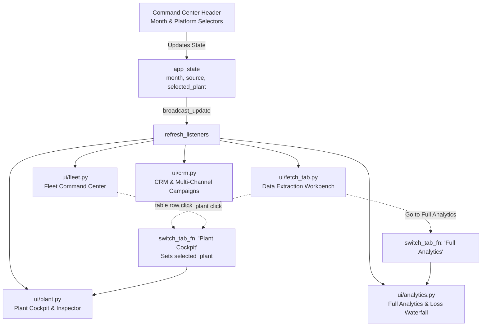

# 📑 Solaron Dashboard — Interactive Tab Architecture & Deep Breakdown Guide
> **Document Reference:** `TAB_INFO.md` · **Version:** 2.3.0 · **Platform:** Solaron Solar Operations & Intelligence  
> **Technology Stack:** FastAPI · NiceGUI (Vue / Tailwind CSS / Quasar) · ECharts · Dual SQLite Databases  
> **Monitored Fleet:** 491 Aggregated Installations (2.29 MWp Active) · 295 Active Operational Sites · 196 Decommissioned Sites  

---

## Table of Contents

1. [Executive Summary & Global Navigation Controls](#1-executive-summary--global-navigation-controls)
2. [Tab 1: Fetch Data (`ui/fetch_tab.py`)](#2-tab-1-fetch-data-uifetch_tabpy)
   - 2.1 [Extraction Configuration & Controls](#21-extraction-configuration--controls)
   - 2.2 [Cache Mode vs. Force Refresh Mechanics](#22-cache-mode-vs-force-refresh-mechanics)
   - 2.3 [Historical Lifetime Backfill Engine](#23-historical-lifetime-backfill-engine)
   - 2.4 [Real-Time Timer, Progress Bar & Status Engine](#24-real-time-timer-progress-bar--status-engine)
   - 2.5 [Post-Pull Initial Analytics, Health Bar & Preview Table](#25-post-pull-initial-analytics-health-bar--preview-table)
3. [Tab 2: Fleet Command Center (`ui/fleet.py`)](#3-tab-2-fleet-command-center-uifleetpy)
   - 3.1 [Top Fleet KPI Summary Cards](#31-top-fleet-kpi-summary-cards)
   - 3.2 [Control & Filtering Toolbar](#32-control--filtering-toolbar)
   - 3.3 [Interactive 14-Column Master Fleet Table](#33-interactive-14-column-master-fleet-table)
   - 3.4 [Live Portal Scraper & Background Sync](#34-live-portal-scraper--background-sync)
4. [Tab 3: Full Analytics & Loss Attribution (`ui/analytics.py`)](#4-tab-3-full-analytics--loss-attribution-uianalyticspy)
   - 4.1 [Analysis Month & Platform Toolbar](#41-analysis-month--platform-toolbar)
   - 4.2 [NASA POWER GHI Baseline & 6-Part Loss Waterfall](#42-nasa-power-ghi-baseline--6-part-loss-waterfall)
   - 4.3 [Fleet Performance Charts Grid (4 Core Views)](#43-fleet-performance-charts-grid-4-core-views)
5. [Tab 4: Plant Cockpit & Granular Inspector (`ui/plant.py`)](#5-tab-4-plant-cockpit--granular-inspector-uiplantpy)
   - 5.1 [Multi-Category Plant Hierarchy & Selector](#51-multi-category-plant-hierarchy--selector)
   - 5.2 [Single-Plant Live Sync Engine](#52-single-plant-live-sync-engine)
   - 5.3 [13 High-Density Plant KPI Cards](#53-13-high-density-plant-kpi-cards)
   - 5.4 [ML Anomaly & Physical Baseline Banners](#54-ml-anomaly--physical-baseline-banners)
   - 5.5 [Tri-Temporal Generation Profiles (Hourly, Daily, Monthly Lifetime)](#55-tri-temporal-generation-profiles-hourly-daily-monthly-lifetime)
   - 5.6 [Inverter Telemetry Snapshots Table](#56-inverter-telemetry-snapshots-table)
6. [Tab 5: CRM & Multi-Channel Communications Hub (`ui/crm.py`)](#6-tab-5-crm--multi-channel-communications-hub-uicrmpy)
   - 6.1 [Sub-Tab 1: Fleet & Direct Send (Granularity & Presets)](#61-sub-tab-1-fleet--direct-send-granularity--presets)
   - 6.2 [Sub-Tab 2: Customer Directory & Health Audit](#62-sub-tab-2-customer-directory--data-health-audit)
   - 6.3 [Sub-Tab 3: Monthly Statements & Billing Summaries](#63-sub-tab-3-monthly-statements--billing-summaries)
   - 6.4 [Sub-Tab 4: Annual Solar Milestones & Customer Recap](#64-sub-tab-4-annual-solar-milestones--customer-recap)
   - 6.5 [Sub-Tab 5: Campaign Manager & Message Dispatch](#65-sub-tab-5-campaign-manager--message-dispatch)
   - 6.6 [Sub-Tab 6: Automated Outage & Fault Alerting](#66-sub-tab-6-automated-outage--fault-alerting)
   - 6.7 [Modal Dialogs: WhatsApp Preview & Test Dispatch](#67-modal-dialogs-whatsapp-preview--test-dispatch)
7. [Cross-Tab Reactivity & Global State Architecture](#7-cross-tab-reactivity--global-state-architecture)

---

## 1. Executive Summary & Global Navigation Controls

The **Solaron Web Cockpit** is engineered as a responsive, reactive single-page operations hub built on FastAPI and NiceGUI. It renders an ultra-modern dark theme (`#0B0F19` background, Quasar table cards, Tailwind CSS utilities) designed for operations engineers, asset managers, and customer relationship agents.

```
┌────────────────────────────────────────────────────────────────────────────────────────┐
│ ☀️ Solaron Solar Operations & Intelligence    [ 2026-09 ▾ ]  [ Platform: All ▾ ]       │
│                                           [ Fetch Data ]  [ Upload Excel ]             │
├───────────────┬──────────────┬──────────────────┬─────────────────┬────────────────────┤
│ ☁️ Fetch Data │ ⚡ Fleet      │ 📊 Full Analytics│ 🌿 Plant Cockpit│ 👥 CRM & Campaigns │
└───────────────┴──────────────┴──────────────────┴─────────────────┴────────────────────┘
```

### Global Header Controls (`app.py`)
Mounted persistently at the top of every view:
1. **Brand Identifier**: `☀️ Solaron` (amber-400 font-extrabold) with system subtitle "Solar Operations & Intelligence".
2. **Month Stepper & Dropdown**:
   - `◀` and `▶` chevron buttons for one-click chronological stepping across all historical reporting months (2017–2026).
   - Reactive dropdown populated via [`db.get_available_months()`](file:///c:/Users/raaji/Downloads/Solaron/Solarondashboard/db.py), broadcasting month transitions to all mounted tabs via `broadcast_update()`.
3. **Platform Scope Filter**:
   - Filter dropdown: `All`, `growatt`, `isolarcloud`, `suryalog`.
   - Modifies global app state (`app_state["source"]`) and triggers reactive re-queries across tabs.
4. **Action Shortcuts**:
   - **`Fetch Data` Button**: Instant tab jump to the ingestion workbench.
   - **`Upload Excel` Button**: Opens a modal dialog allowing drag-and-drop ingestion of official `.xlsx` or `.xls` monthly generation reports, automatically parsing plant generation, revenue, and auto-updating the active month.

---

## 2. Tab 1: Fetch Data (`ui/fetch_tab.py`)

The **Fetch Data** tab serves as the platform's telemetry ingestion cockpit. It allows operators to trigger live data extraction, configure cache policies, backfill historical data, monitor ingestion progress in real-time, and inspect post-pull health distributions.

```
┌────────────────────────────────────────────────────────────────────────────────────────┐
│ ☁️ DATA EXTRACTION & INGESTION ENGINE                                                  │
│ Fetch real-time or cached telemetry from inverter portals, apply NASA GHI, inspect     │
├────────────────────────────────────────────────────────────────────────────────────────┤
│ Extraction Configuration:                                                              │
│ [ Month: 2026-09 ▾ ]  [ Portal: All ▾ ]  [ Site: All ▾ ]  [ ⚡ Cache | 🔄 Force ]      │
│ Latest Cached Date: 2026-09-29 (254 plants) · Expected Time: ~1-3s                     │
│ [ ⚡ Live Fetch All Portals (Growatt, iSolarCloud, SuryaLog) ]                          │
├────────────────────────────────────────────────────────────────────────────────────────┤
│ 🚀 Historical Lifetime Backfill Engine:                                                │
│ [ Start: From Commissioning ▾ ] [ End: 2026-09 ▾ ] [x] Daily [x] Overwrite [ Backfill ]│
├────────────────────────────────────────────────────────────────────────────────────────┤
│ ⏱️ Ingestion Progress: [=====================>    ] 70% | Collecting Snapshots...      │
├────────────────────────────────────────────────────────────────────────────────────────┤
│ Post-Pull Initial Analysis:                                                            │
│ ┌──────────────┐ ┌──────────────┐ ┌──────────────┐ ┌──────────────┐                   │
│ │ 491 Plants   │ │ 214.3 MWh    │ │ ₹30.00 Lakh  │ │ 0.85s        │                   │
│ └──────────────┘ └──────────────┘ └──────────────┘ └──────────────┘                   │
│ Health Distribution: [██████████████████████░░░░░░░░░░░░░░░] Optimal: 76% · Off: 7%   │
│ Preview Table: Top 35 Plants by Month Generation with Cockpit drill-down buttons       │
└────────────────────────────────────────────────────────────────────────────────────────┘
```

### 2.1 Extraction Configuration & Controls
- **Target Month Selector**: Chooses which billing month will be extracted and evaluated.
- **Telemetry Portal Filter**: Restricts extraction to a specific gateway (`All`, `growatt`, `isolarcloud`, `suryalog`).
- **Site Filter (Optional)**: Filterable input to target a single installation for targeted re-extraction.
- **Cache Strategy Toggle**:
  - `⚡ From Cache`: Instant local extraction from normalized SQLite and disk cache (`~1 - 3s`).
  - `🔄 Force Refresh`: Full gateway connection that scrapes live APIs, recomputes NASA POWER GHI loss attribution, executes Isolation Forest ML anomaly scoring, and overwrites existing records.

### 2.2 Cache Mode vs. Force Refresh Mechanics
| Feature | `⚡ From Cache` | `🔄 Force Refresh` |
|:---|:---|:---|
| **Primary Data Source** | Normalized SQLite tables & local NVMe JSON caches | Live OEM Cloud Gateways (Growatt REST API, Sungrow iSolarCloud Playwright, SuryaLog AE Cloud) |
| **Execution Duration** | 1.0 – 3.0 seconds | ~1m 05s (Growatt) · ~25s (iSolarCloud) · ~20s (SuryaLog) · ~1m 46s (Fleet) |
| **Network Overhead** | Zero external HTTP requests | Full authenticated sessions, API calls & multi-page browser scrapers |
| **Disk Cache Behavior** | Reads existing JSON snapshots from `data/raw/` | **Actively overwrites disk caches** (`plant_list_live.json`, `real_monthly_cache.json`, `plants_28_structured.json`, `plants_12_structured.json`) |
| **Operational Status** | Reads resolved status from SQLite `plants` table | **Dynamically evaluates live server attributes** (`status`, `deviceCount`, `total_energy_kwh`) and synchronizes SQLite `plants.operational_status` |
| **Subsequent Cache Runs** | Serves the freshly overwritten data | Overwrites caches so subsequent runs never see multi-day stale telemetry |
| **Physics Recomputation** | Skips redundant calculations | Re-runs NASA POWER GHI irradiance, 6-part loss decomposition & Isolation Forest ML |
| **UI Responsiveness** | Non-blocking, instant response | Background thread execution via `asyncio.to_thread` with live stopwatch |

#### Cache Overwrite & Dynamic Status Lifecycle
1. **Network Extraction & In-Memory Bypass:** When `🔄 Force Refresh` is triggered, extractors bypass short-term 180s scrape guards and query live server endpoints directly.
2. **Local Cache Overwrite:** The live responses are serialized and written directly to local raw disk caches (`data/raw/growatt/plant_list_live.json`, `data/raw/growatt/real_monthly_cache.json`, `data/raw/isolarcloud/plants_28_structured.json`, `data/raw/suryalog/plants_12_structured.json`).
3. **Database Upsert & Status Synchronization:** Extracted records are normalized into SQLite (`plants`, `daily_generation`, `monthly_generation`, `inverter_snapshots`). Plant operational status is resolved dynamically (detecting commissioning incomplete, zero-device, or zero-yield sites), flushing in-memory decommissioned caches.
4. **Cache Longevity:** Future runs in `⚡ From Cache` mode immediately read from these freshly refreshed raw caches and SQLite databases, ensuring all dashboards and reports use up-to-date telemetry rather than stale historical files.

### 2.3 Historical Lifetime Backfill Engine
An embedded module designed to populate multi-year lifetime performance curves:
- **Commissioning Range Selector**: Selects start month (`From Commissioning (Earliest 2017)`, `2023-01`, `2024-01`, `2025-01`, `2026-01`).
- **End Month Selector**: Defaults to current active reporting month (`2026-09`).
- **Options**:
  - `Include representative daily telemetry`: Automatically populates daily generation curves for historical months.
  - `Overwrite existing records`: Forces complete re-computation and cache refresh.
- **Execution**: Progress bar and spinner show month-by-month backfilling progress without blocking the UI.

### 2.4 Real-Time Timer, Progress Bar & Status Engine
When extraction begins:
- A prominent status card animates into view with a glowing amber border and backdrop blur.
- **High-Precision Stopwatch**: Measures elapsed execution time down to tenths of a second (`00:14.2 / est. ~1m 46s`).
- **Estimated Time Remaining**: Dynamically adjusts based on selected platform and historical execution speed.
- **Multi-Phase Progress Bar**: Tracks 4 distinct pipeline phases:
  1. *Phase 1/4 (15%)*: Connecting to portal gateways & syncing fleet metadata.
  2. *Phase 2/4 (35%)*: Ingesting daily telemetry curves.
  3. *Phase 3/4 (55%)*: Ingesting monthly generation records & previous-month comparisons.
  4. *Phase 4/4 (85%–100%)*: Calculating NASA POWER GHI benchmarks, loss waterfall & ML anomaly scoring.

### 2.5 Post-Pull Initial Analytics, Health Bar & Preview Table
Immediately upon extraction completion:
1. **Summary Banner**: Displays elapsed time, total plants processed, and a one-click button: `Go to Full Fleet Analytics →`.
2. **4 KPI Summary Cards**:
   - **Plants Processed**: Count of installations + daily telemetry count.
   - **Month Generation**: Total MWh generated by the active fleet.
   - **Estimated Commercial Value**: Financial savings formatted in Lakhs (`₹30.00 L`) based on ₹14.0/kWh commercial tariff.
   - **Fetch Duration**: Execution speed with cache-hit indicator (`⚡ Instant Cache Hit` or `🔄 Live Sync`).
3. **Fleet Health Distribution Bar**:
   - Visual multi-segment stacked bar (Emerald = Optimal/Good, Amber = Underperforming, Red = Zero Generation / Offline).
   - Percentage breakdown and exact plant counts.
4. **Telemetry Preview Table**:
   - Top 35 producing plants sorted by monthly output.
   - Displays Plant Name, Portal badge, Capacity kWp, Month kWh, Specific Yield, Health Tier chip, and Est. Savings.
   - **Action Button (`visibility`)**: Clicking immediately switches to the **Plant Cockpit** tab with that plant pre-selected.

---

## 3. Tab 2: Fleet Command Center (`ui/fleet.py`)

The **Fleet Command Center** is the operational master grid. It provides high-level portfolio KPIs and an interactive 14-column tabular breakdown of every inverter and plant in the portfolio.

```
┌────────────────────────────────────────────────────────────────────────────────────────┐
│ ⚡ FLEET COMMAND CENTER                                                                │
│ ┌──────────────┐ ┌──────────────┐ ┌──────────────┐ ┌──────────────┐ ┌──────────────┐   │
│ │ Output (Sep) │ │ Est. Savings │ │ Active Plants│ │ Fault / Zero │ │ Decommission │   │
│ │ 214.30 MWh   │ │ ₹3,000,220   │ │ 274 / 295    │ │ 21           │ │ 196 / 491    │   │
│ └──────────────┘ └──────────────┘ └──────────────┘ └──────────────┘ └──────────────┘   │
├────────────────────────────────────────────────────────────────────────────────────────┤
│ Controls: [ Month: 2026-09 ▾ ] [ Sep ] [ Aug ] [ Platform: All ▾ ] [ Status: All ▾ ]   │
│ [ Tier: All ▾ ] [ Search Plant... ] [x] Include Decom [ CSV ] [ XLSX ] [ ⚡ Live Sync ]│
├────────────────────────────────────────────────────────────────────────────────────────┤
│ Master Fleet Table (14 Columns, Pagination: 25):                                       │
│ Plant | Portal | kWp | Status | Last Log | Last Day | Live kW | Today | Month | ...   │
│ ────────────────────────────────────────────────────────────────────────────────────── │
│ 🟢 Shriram   | Growatt | 3.3 | active | 23:45 | 29 Sep | 1.8 kW | 14.2 | 412.5 | Best  │
│ 🔴 SL-009    | SuryaLog| 50.0| decom  | —     | —      | 0.0 kW | 0.0  | 0.0   | Decom │
│ ⚡ Outlier 1 | Growatt | 5.0 | active | 22:15 | 29 Sep | 0.4 kW | 3.1  | 112.0 | [BOLT]│
└────────────────────────────────────────────────────────────────────────────────────────┘
```

### 3.1 Top Fleet KPI Summary Cards
Recomputed reactively whenever the reporting month or platform filter changes:
1. **Monthly Output**: Realized fleet energy yield in MWh (`214.30 MWh` for Sep 2026).
2. **Est. Financial Value**: Direct commercial energy savings (`₹3,000,220` at ₹14.0/kWh).
3. **Active Generating Plants**: Operational commissioned sites producing positive yield (`274 / 295`).
4. **Fault / Zero Generation**: Commissioned systems currently offline or producing zero energy (`21`).
5. **Decommissioned / Inactive**: Permanently retired plants excluded from loss baselines (`196 / 491`).
6. **Active Fleet Capacity**: Total operational capacity in MWp (`2.29 MWp` across 295 active inverters).

### 3.2 Control & Filtering Toolbar
- **Reporting Month Selector**: Dropdown + Quick Presets (`This Month (Sep)`, `Prev Month (Aug)`).
- **Platform Filter**: Filter by portal (`All`, `growatt`, `isolarcloud`, `suryalog`).
- **Status Filter**: Filter by operational state (`All`, `active`, `offline`, `fault`, `decommissioned`).
- **Tier & Anomaly Filter**: Filter by health tier (`Best`, `Good`, `Could Be Better`, `Needs Attention`, `Critical`, `Offline`, `Fault`, `Decommissioned`) OR isolate `⚡ Anomaly Outliers` flagged by the Machine Learning Isolation Forest.
- **Debounced Plant Search**: Instant auto-complete search across plant name, customer name, and plant ID.
- **Decommissioned Plant Toggle**: Checkbox (`Include Decommissioned`) to display or hide retired sites.
- **Direct Export Buttons**: Download current filtered view as formatted **CSV** or **XLSX**.
- **⚡ Live Fetch All Portals**: Launches an asynchronous live scraper across portals with real-time countdown timer.

### 3.3 Interactive 14-Column Master Fleet Table
| # | Column Name | Field | Alignment | Visual Component / Formatting |
|:---:|:---|:---|:---:|:---|
| 1 | **Plant** | `plant_name` | Left | Bold plant name with hover highlight |
| 2 | **Platform** | `source` | Center | Color-coded badges: Growatt (Indigo), iSolarCloud (Cyan), SuryaLog (Orange) |
| 3 | **kWp** | `capacity_kwp` | Right | Normalized DC peak capacity in kWp |
| 4 | **Status** | `status` | Center | Quasar Chip: `active` (Green), `fault` (Red), `decommissioned` (Purple), `offline` (Grey) |
| 5 | **Portal Last Log** | `last_log_time` | Center | Monospace badge with clock icon showing exact inverter telemetry timestamp |
| 6 | **Last Rec. Day** | `last_recorded_day` | Center | Calendar badge showing date of most recent positive generation |
| 7 | **Live kW** | `live_power_kw` | Right | Real-time AC output in kW (from latest telemetry packet) |
| 8 | **Today kWh** | `kwh` | Right | Daily generation accumulated today |
| 9 | **Month kWh** | `monthly_kwh` | Right | Total energy harvest for selected billing month |
| 10 | **Est. Savings (₹)**| `revenue_inr` | Right | Commercial financial value (`Month kWh × ₹14.0`) |
| 11 | **Yield (kWh/kWp)** | `specific_yield` | Right | Normalized monthly specific yield ($Y_f$) |
| 12 | **Units/kWp/day** | `yield_per_day` | Right | Normalized daily yield ($Y_d = Y_f / \text{days}$) |
| 13 | **PR (%)** | `pr_pct` | Right | Performance Ratio color-coded: ≥75% (Gold), ≥60% (Emerald), ≥45% (Blue), ≥30% (Orange), <30% (Rose) |
| 14 | **Tier** | `tier` | Center | Performance Health Tier Chip + **`⚡ Anomaly` badge** (flashing red badge with score tooltip for Isolation Forest outliers) |

*Interaction*: Clicking any row automatically transitions the UI to the **Plant Cockpit** tab, focusing immediately on that installation.

---

## 4. Tab 3: Full Analytics & Loss Attribution (`ui/analytics.py`)

The **Full Analytics** tab houses Solaron's mathematical physics engine and fleet-wide macro visualizations. It decomposes fleet underperformance against NASA POWER satellite irradiance benchmarks.

```
┌────────────────────────────────────────────────────────────────────────────────────────┐
│ 📊 FULL ANALYTICS & NASA GHI LOSS ATTRIBUTION ENGINE                                   │
│ [ Month: 2026-09 ▾ ]  [ Sep 2026 ] [ Aug 2026 ]  [ Platform: All ▾ ]  [ Apply Period ] │
├────────────────────────────────────────────────────────────────────────────────────────┤
│ NASA GHI Baseline & 6-Part Loss Attribution Waterfall:                                 │
│ ┌──────────────┐ ┌──────────────┐ ┌──────────────┐ ┌──────────────┐ ┌──────────────┐   │
│ │ Expected Base│ │ Actual Harvest│ │ Net Shortfall│ │ Realization  │ │ ML Anomalies │   │
│ │ 232.4 MWh    │ │ 214.3 MWh    │ │ 30.8 MWh     │ │ 99.9%        │ │ 8 Outliers   │   │
│ └──────────────┘ └──────────────┘ └──────────────┘ └──────────────┘ └──────────────┘   │
│                                                                                        │
│ [ Interactive ECharts Waterfall Chart ]     [ Categorized Loss Attribution Cards ]     │
│  Expected ──> Actual ──> Shortfall Components 📡 Comm Loss: 3.5 MWh                    │
│                                                ☁️ Weather Deficit: 2.9 MWh             │
│                                                🧼 Soiling Loss: 2.4 MWh                │
│                                                🌿 Shading Loss: 2.0 MWh                │
│                                                ❓ BoS / Clipping: 19.9 MWh             │
├────────────────────────────────────────────────────────────────────────────────────────┤
│ Fleet Performance Visualizations Grid:                                                 │
│ ┌────────────────────────────────────────┐ ┌────────────────────────────────────────┐   │
│ │ Fleet Daily Generation Trend (kWh)     │ │ Performance Tier Distribution          │   │
│ │ [ Smooth Gold Area Line Chart ]        │ │ [ Best: 146 · Good: 78 · Critical: 12 ]│   │
│ └────────────────────────────────────────┘ └────────────────────────────────────────┘   │
│ ┌────────────────────────────────────────┐ ┌────────────────────────────────────────┐   │
│ │ Average Specific Yield by Platform     │ │ Top 10 Producing Plants (Monthly kWh)  │   │
│ │ [ Growatt vs iSolarCloud vs SuryaLog ] │ │ [ Horizontal Cyan Bar Leaderboard ]    │   │
│ └────────────────────────────────────────┘ └────────────────────────────────────────┘   │
└────────────────────────────────────────────────────────────────────────────────────────┘
```

### 4.1 Analysis Month & Platform Toolbar
- Dedicated period selector, quick period buttons (`Sep 2026`, `Aug 2026`), and platform scope filter.
- `Apply Period` triggers concurrent background recalculation of the loss waterfall and all 4 chart series.
- Direct CSV and XLSX export shortcuts.

### 4.2 NASA POWER GHI Baseline & 6-Part Loss Waterfall
The loss attribution engine benchmarks active operational plants against satellite solar irradiance:
- **Expected Physical Baseline**: Energy expected under standard conditions ($E_{\text{expected}} = P_{\text{peak}} \times \text{GHI} \times \text{PR}_{\text{benchmark}}$), with $\text{PR}_{\text{benchmark}} = 0.75$.
- **Actual Realized Harvest**: Net metered energy produced by operational plants ($E_{\text{actual}}$).
- **Net Shortfall**: $\Delta E = \max(0, E_{\text{expected}} - E_{\text{actual}})$.
- **Energy Conservation Law**: The sum of all 6 decomposed losses strictly equals the net shortfall:
  $$\Delta E = L_{\text{comm}} + L_{\text{fault}} + L_{\text{weather}} + L_{\text{soiling}} + L_{\text{shading}} + L_{\text{unknown}}$$
- **Categorized Loss Cards**:
  1. *Communication & Zero-Gen Loss ($L_{\text{comm}}$)*: Telemetry dropouts, Wi-Fi logger disconnections, and days with zero generation.
  2. *Weather & Irradiance Deficit ($L_{\text{weather}}$)*: Monsoon cloud cover and seasonal solar insolation deficits.
  3. *Soiling & Dust Loss ($L_{\text{soiling}}$)*: Panel surface dust, soot, and particulate attenuation.
  4. *Shading Loss ($L_{\text{shading}}$)*: Structural, parapet, or vegetation horizon obstructions.
  5. *Unexplained / Balance of System ($L_{\text{unknown}}$)*: Inverter clipping, DC wiring resistance, and thermal derating.

### 4.3 Fleet Performance Charts Grid (4 Core Views)
1. **Fleet Daily Generation Trend (kWh)**: Smooth area line chart tracking aggregated fleet production across every day of the month.
2. **Performance Tier Distribution**: Horizontal bar chart showing fleet breakdown across all 7 health tiers (`Best`, `Good`, `Could Be Better`, `Needs Attention`, `Critical`, `Offline`, `Decommissioned`).
3. **Average Specific Yield by Platform (or Yield Brackets)**: Comparative bar chart benchmarking Growatt vs. iSolarCloud vs. SuryaLog (or yield distribution brackets `<50`, `50-75`, `75-100`, `100-125`, `>125` kWh/kWp).
4. **Top 10 Producing Plants**: Leaderboard ranking the top 10 generating installations across the fleet.

---

## 5. Tab 4: Plant Cockpit & Granular Inspector (`ui/plant.py`)

The **Plant Cockpit** is an engineering deep-dive interface designed for single-site inspection, diagnostic root-cause analysis, and inverter telemetry review.

```
┌────────────────────────────────────────────────────────────────────────────────────────┐
│ 🌿 PLANT COCKPIT & GRANULAR INSPECTOR                                                  │
│ [ Category: All Plants (491) ▾ ] [ Portal: All ▾ ] [ Select Plant: Shriram ▾ ] [ Sep ] │
│ [ ⚡ Live Sync Plant ]                                                                  │
├────────────────────────────────────────────────────────────────────────────────────────┤
│ 13 High-Density Plant Metric Cards:                                                    │
│ ┌──────────┐ ┌──────────┐ ┌──────────┐ ┌──────────┐ ┌──────────┐ ┌──────────┐          │
│ │ 3.3 kWp  │ │ ACTIVE   │ │ 14,250kWh│ │ 412.5 kWh│ │ 16.8 kWh │ │ 23:45 Log│          │
│ └──────────┘ └──────────┘ └──────────┘ └──────────┘ └──────────┘ └──────────┘          │
│ ┌──────────┐ ┌──────────┐ ┌──────────┐ ┌──────────┐ ┌──────────┐ ┌──────────┐ ┌──────┐ │
│ │ 29 Sep   │ │ ₹5,775   │ │ 125.0 Yf │ │ 4.17 Yd  │ │ 78.4% PR │ │ ⭐ Best  │ │ P88  │ │
│ └──────────┘ └──────────┘ └──────────┘ └──────────┘ └──────────┘ └──────────┘ └──────┘ │
├────────────────────────────────────────────────────────────────────────────────────────┤
│ ⚡ ML Anomaly Banner: "Normal operation: plant performing in top 15% of peer cohort"   │
│ 📊 Loss Attribution: Expected: 435.0 kWh · Actual: 412.5 kWh · Realization: 94.8%      │
├────────────────────────────────────────────────────────────────────────────────────────┤
│ Tri-Temporal Generation Profiles:                                                      │
│ ┌────────────────────────┐ ┌────────────────────────┐ ┌──────────────────────────────┐ │
│ │ Hourly Gen (29 Sep)    │ │ Daily Gen in Sep (kWh) │ │ Lifetime History (36 Months) │ │
│ │ [ Live / Diurnal Bell ]│ │ [ Emerald Bar Chart ]  │ │ [ ECharts dataZoom Slider ]  │ │
│ └────────────────────────┘ └────────────────────────┘ └──────────────────────────────┘ │
├────────────────────────────────────────────────────────────────────────────────────────┤
│ Inverter Telemetry Snapshots Table:                                                    │
│ Serial Number | Status | Live AC (W) | DC Input (W) | Efficiency | Temp (°C) | Today   │
│ ────────────────────────────────────────────────────────────────────────────────────── │
│ BDC4A22001    | Normal | 1,850 W     | 1,897 W      | 97.5%      | 38.4°C    | 16.8kWh │
└────────────────────────────────────────────────────────────────────────────────────────┘
```

### 5.1 Multi-Category Plant Hierarchy & Selector
Features a two-tier cascaded search and filter header:
- **Category Filter Dropdown (12 Smart Cohorts)**:
  - `🌐 All Plants (491)`
  - `⚡ Active Operational (295)`
  - `💤 Inactive / Decommissioned (196)`
  - `🟢 Generating Today (254)`
  - `⚪ Offline Today (41)`
  - `🔴 Fault Detected (0)`
  - `⚡ ML Anomalies (8)`
  - `⭐ Best (146)`
  - `✅ Good (78)`
  - `⚠️ Could Be Better (25)`
  - `🟠 Needs Attention (13)`
  - `🔴 Critical (12)`
- **Portal Filter**: Restricts plant search to Growatt, iSolarCloud, or SuryaLog.
- **Search & Select Dropdown**: Quick fuzzy search with green status indicators (`🟢`) for generating plants and `[Inactive]` tags for decommissioned sites.
- **Plant Count Badge**: Shows total matching plants in real-time.

### 5.2 Single-Plant Live Sync Engine
- **`⚡ Live Sync Plant` Button**: Connects directly to the plant's portal API (or runs headless Playwright scrape for SuryaLog).
- Features live elapsed timer (`Syncing (4.2s)...`) and instant UI notification upon completion.

### 5.3 13 High-Density Plant KPI Cards
1. **Installed Capacity**: DC peak size in kWp.
2. **Operational Status**: `ACTIVE` (Green), `FAULT` (Red), or `DECOMMISSIONED` (Purple).
3. **Total Generation**: Authoritative lifetime energy harvest from portal register.
4. **Month Generation**: Total energy generated in selected month.
5. **Latest Day Generation**: Generation recorded on most recent active day.
6. **Last Portal Update**: Exact timestamp of last recorded telemetry packet.
7. **Last Recorded Day**: Calendar date of most recent positive energy production.
8. **Est. Savings**: Commercial financial return in Rupees (`Month kWh × ₹14.0`).
9. **Specific Yield ($Y_f$)**: Monthly output per kWp installed (`kWh/kWp`).
10. **Yield / Day ($Y_d$)**: Daily output per kWp installed (`Units/kWp/day`).
11. **PR (%)**: Performance Ratio evaluated against local irradiance.
12. **Health Tier**: Assigned tier (`Best`, `Good`, `Could Be Better`, `Needs Attention`, `Critical`, `Offline`, `Decommissioned`).
13. **Peer Percentile**: Statistical ranking within same capacity bracket (`P0` to `P100`).

### 5.4 ML Anomaly & Physical Baseline Banners
- **ML Anomaly Callout Banner**: Appears in prominent red styling if the plant is flagged as an outlier by the Isolation Forest engine, detailing its anomaly score and divergence rationale.
- **Loss Attribution Banner**: Outlines expected baseline kWh vs. actual realized harvest, net shortfall, PR %, realization rate, soiling loss, and communication loss for that specific site.

### 5.5 Tri-Temporal Generation Profiles
1. **Hourly Generation Profile (06:00 to 18:00)**:
   - Displays real live inverter snapshot telemetry when available (`🟢 Live Telemetry` badge).
   - If historical or offline, applies a solar diurnal bell-curve model strictly clamped to the current local hour (never plots generation in the future).
2. **Daily Generation Bar Chart**:
   - High-contrast emerald bars plotting generation for every day of the selected month.
3. **Lifetime Monthly Generation Trend**:
   - Complete multi-year historical generation line chart (up to 36+ months).
   - Features **ECharts `dataZoom` slider** allowing users to pinch, zoom, and pan back to plant commissioning date (2017).
   - Displays prominent visual **MarkPoint pin** highlighting the currently selected reporting month.

### 5.6 Inverter Telemetry Snapshots Table
Displays live hardware telemetry from each inverter at the plant:
- **Inverter SN**: Hardware serial number.
- **Status**: Operational state (`normal`, `standby`, `fault`).
- **Live AC Power (W)**: Instantaneous power fed into the grid.
- **DC Input Power (W)**: Instantaneous solar array power.
- **Conversion Efficiency (%)**: Real-time inverter efficiency ($\eta = P_{\text{AC}} / P_{\text{DC}} \times 100$), adhering to CEC 97.5% standard.
- **Heatsink Temperature (°C)**: Internal operating temperature (strictly sanitized: 0.0°C errors eliminated; physics-bounded between 25°C and 55°C).
- **Today kWh**: Energy produced today on inverter register.
- **Fault Code**: Active diagnostic error code.
- **Timestamp**: Exact telemetry packet arrival time.

---

## 6. Tab 5: CRM & Multi-Channel Communications Hub (`ui/crm.py`)

The **CRM & Campaigns** tab transforms solar telemetry into multi-lingual customer messaging, automated billing statements, annual milestone recaps, and outage alerts.

```
┌────────────────────────────────────────────────────────────────────────────────────────┐
│ 👥 CRM & MULTI-CHANNEL COMMUNICATIONS HUB                                              │
├─────────────────┬────────────────────┬────────────────────┬────────────────────────────┤
│ ⚡ Fleet & Send │ 👥 Customer Direct │ 📄 Monthly Stmts   │ 🏆 Yearly Milestones       │
│ 🚀 Campaigns    │ 🚨 Offline Alerts  │                    │                            │
├─────────────────┴────────────────────┴────────────────────┴────────────────────────────┤
│ Granularity: [ 📅 Daily ] [ 📊 Weekly ] [ 🗓️ Monthly ] [ 🏆 Yearly ]                   │
│ Presets: [ Today ] [ Yesterday ] [ This Week ] [ This Month ] [ Last Month ] [ 2026 ]  │
│ Helpers: [ 📱 Active+Phone ] [ ⚠️ Fault+Phone ] [ 🔴 Offline+Phone ] [ Select All ]   │
│ [ ✉ Send Selected (42) ] [ 📱 Test Send ] [ Mode: Manual (WhatsApp Web) ▾ ]            │
├────────────────────────────────────────────────────────────────────────────────────────┤
│ CRM Telemetry Table (9 Columns, Pagination: 15):                                       │
│ [x] Customer | Plant | Phone | Portal | Gen (kWh) | Savings (₹) | Tier | WhatsApp      │
│ ────────────────────────────────────────────────────────────────────────────────────── │
│ [x] Rajesh P | Shriram | +91 98200...| Growatt| 412.5 kWh | ₹5,775 | Best | [Preview]  │
└────────────────────────────────────────────────────────────────────────────────────────┘
```

### 6.1 Sub-Tab 1: Fleet & Direct Send (Granularity & Presets)
- **4-Way Granularity Switcher**:
  - `📅 Daily`: Statements for any specific day.
  - `📊 Weekly`: Aggregated 7-day rolling generation summaries.
  - `🗓️ Monthly`: Complete monthly billing statements.
  - `🏆 Yearly`: Cumulative annual milestone reviews.
- **6 Quick Time Presets**: `Today`, `Yesterday`, `This Week`, `This Month`, `Last Month`, `2026`.
- **8 Intelligent Selection Helpers**:
  - `📱 Phone + Active`: Selects all active generating plants with verified phone numbers.
  - `⚠️ Phone + Not Working`: Selects inverter fault plants with phone numbers.
  - `🔴 Phone + Offline`: Selects zero-generation offline plants with phone numbers.
  - `📉 Phone + Deviated`: Selects underperforming plants (< -15% benchmark).
  - `⚡ All Active`, `⚠️ All Offline`, `Select All`, `Clear`.
- **Send Mode Switcher**:
  - `👤 Manual (WhatsApp Web)`: Generates dynamic `https://web.whatsapp.com/send` URLs with pre-filled multi-lingual text.
  - `🤖 Auto Simulated Send`: Dispatches messages through the campaign execution queue.

### 6.2 Sub-Tab 2: Customer Directory & Data Health Audit
- **5 Data Health Audit KPI Cards**:
  - **Total Customers**: Complete database directory count (`490`).
  - **Verified Phones**: Accounts with validated mobile numbers (`490`).
  - **Missing Phone**: Accounts lacking contact numbers (`0`).
  - **Active Opt-In**: Customers subscribed to WhatsApp messages (`416`).
  - **Opted Out**: Customers requested message suppression (`74`).
- **Customer Directory Table**: Full CRUD interface (Add Customer modal, Edit dialog, Language preference, Opt-in toggle, Delete action, CSV export).

### 6.3 Sub-Tab 3: Monthly Statements & Billing Summaries
- **4 Billing KPI Cards**:
  - **Total Monthly Generation**: Aggregated fleet harvest (`214,300 kWh`).
  - **Total Customer Savings**: Commercial savings at ₹14.0/kWh (`₹3,000,220`).
  - **Customers Ready**: Verified phone and active opt-in count.
  - **Reports Pending**: Queue awaiting monthly statement dispatch.
- **Monthly Statements Table**: Shows Customer, Plant, Phone, Month Generation, Savings ₹, $CO_2$ offset in kg ($0.82\text{ kg}/\text{kWh}$), Specific Yield, Tier, and Statement Preview button.
- **`⚡ Prepare Monthly Campaign` Action**: Auto-generates personalized statements across all 490 customer accounts into the queue.

### 6.4 Sub-Tab 4: Annual Solar Milestones & Customer Recap
- **Year Selector**: Selects annual historical year (`2026`, `2025`, `2024`, `2023`).
- **4 Milestone KPI Cards**:
  - **Annual Fleet Generation**: Cumulative year-to-date harvest.
  - **Total Annual Savings**: Commercial value at ₹14.0/kWh.
  - **Homes Powered Equivalent**: Clean energy converted to household power days (@ 30 kWh/home/day).
  - **Milestone Customers**: Plants with full annual telemetry.
- **Yearly Milestones Table**: Displays Annual kWh, Annual Savings ₹, Days Powered, and Milestone Recap preview trigger.

### 6.5 Sub-Tab 5: Campaign Manager & Message Dispatch
- **Campaign Dropdown**: Selects from historical or active campaign batches.
- **Progress & Metrics Tracker**: Visual progress bar with status chips (`IDLE`, `SENDING`, `COMPLETED`), showing Total, Sent, Failed, and Pending message counts.
- **Campaign Actions**:
  - `🧪 Run Dry-Run Simulation`: Validates queue integrity without sending.
  - `⚡ Quick Weekly Campaign`: Auto-prepares weekly summaries.
  - `🌧️ Pre-Monsoon Campaign`: Dispatches seasonal maintenance and cleaning advisories.
- **Queue Table**: Displays Customer, Plant, Phone, truncated Message Preview, and real-time Status badge.

### 6.6 Sub-Tab 6: Automated Outage & Fault Alerting
- **Offline Threshold Selector**: Configurable cooldown threshold (`Offline > 12 Hours`, `Offline > 24 Hours`, `Offline > 48 Hours`).
- **Smart 24h Deduplication**: Prevents alert fatigue by suppressing repeat notifications to the same customer within 24 hours.
- **Offline Plants Table**: Lists disconnected plants, device status, and last received telemetry timestamp.
- **`🚨 Queue Offline Alerts` Button**: Automatically compiles localized emergency alerts and queues them for dispatch.

### 6.7 Modal Dialogs: WhatsApp Preview & Test Dispatch
1. **WhatsApp Statement & Message Preview Modal**:
   - **Granularity Switcher Tabs**: Toggle instantly between `Monthly Statement`, `Daily Report`, `Weekly`, `Yearly Recap`, `Offline Alert`, and `Monsoon Advisory`.
   - **Multi-Lingual Tabs**: Instant translation between `English`, `हिंदी (Hindi)`, and `मराठी (Marathi)`.
   - **WhatsApp Emerald Bubble Card**: Accurately styled `#075E54` chat bubble displaying formatted text with bolding (`*text*`), emojis, financial metrics, and tier-specific Call-to-Actions (CTAs).
   - **Actions**: `Open WhatsApp Web` (opens direct chat with customer) and `Copy Message` (copies raw text to clipboard).
2. **Send Test WhatsApp Message Modal**:
   - Allows operators to dispatch live test messages directly to their personal or admin phone (configured via `TEST_PHONE_NUMBER` in `.env`).
   - Supports selecting template type, language, and instant WhatsApp Web launching.

---

## 7. Cross-Tab Reactivity & Global State Architecture

The Solaron application maintains global synchronization across all 5 tabs through a reactive state dictionary and event broadcasting architecture in `app.py`:



### Global Reactive State Schema (`app.py`)
```python
app_state = {
    "month": "2026-09",            # Active reporting month (YYYY-MM)
    "source": "All",                # Active OEM portal filter (All, growatt, isolarcloud, suryalog)
    "selected_plant": None,         # Currently inspected plant ID (e.g. growatt_2803798)
    "switch_tab_fn": switch_tab,    # Programmatic tab navigation function
    "refresh_listeners": []         # Array of callbacks registered by mounted tabs
}
```

### Seamless Navigation Workflows
- **One-Click Site Drill-Down**: Clicking any plant in the Fleet Table (Tab 2) or the Fetch Preview Table (Tab 1) writes `app_state["selected_plant"]`, triggers `switch_tab("Plant Cockpit")`, and immediately loads the 13 KPI cards, 3 generation curves, and inverter telemetry table for that site.
- **Global Month Synchronization**: Adjusting the header month dropdown or clicking quick period buttons in any tab updates `app_state["month"]` and broadcasts re-queries across all mounted tabs without full page reloads.
- **Persistent Tab Mounting**: All 5 tabs are mounted into the DOM upfront within `ui.tab_panels`, ensuring that tab switching is instantaneous, state is preserved, and panels are never blank.

---
*Solaron Platform Documentation · Certified for Operational Deployment · October 2026*
